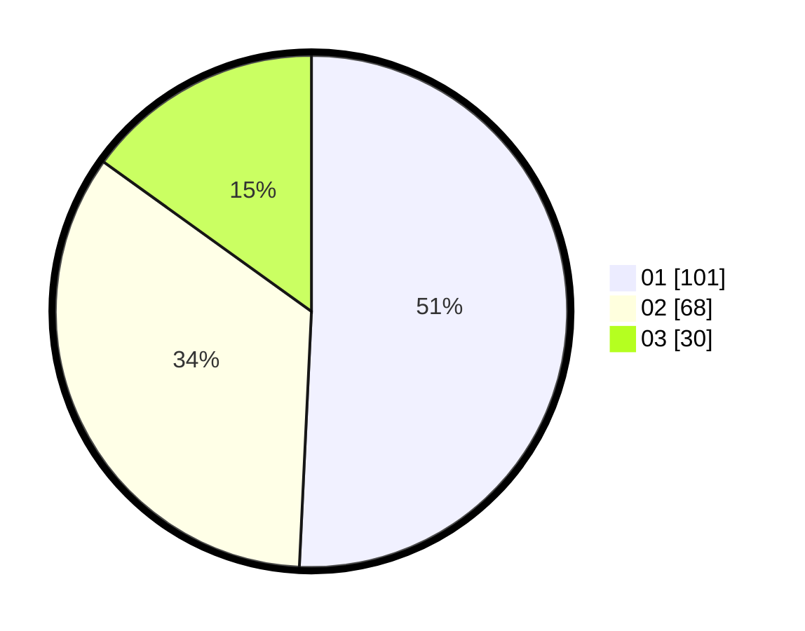

# Hasil

Hasil perolehan suara paslon dapat dilihat pada file paslon-01.txt, paslon-02.txt, dan paslon-03.txt.

Jika tidak ada, artinya data tersebut belum ada pada SIREKAP.

## Perolehan Suara

 * Paslon 01: **101**.
 * Paslon 02: **68**.
 * Paslon 03: **30**.

## Foto C Plano

https://sirekap-obj-formc.kpu.go.id/091f/pemilu/ppwp/31/73/03/10/02/3173031002052-20240216-092457--d5068a6e-3d3b-46f7-8ba0-98fa86a5f5d1.jpg

https://sirekap-obj-formc.kpu.go.id/091f/pemilu/ppwp/31/73/03/10/02/3173031002052-20240216-092459--fca084bc-2736-45b6-ad62-2540a57f3bba.jpg

https://sirekap-obj-formc.kpu.go.id/091f/pemilu/ppwp/31/73/03/10/02/3173031002052-20240216-092458--e5da9daf-ac68-4c24-a941-810b80fe5052.jpg

## DATA PEMILIH TETAP

Jumlah pemilih dalam DPT: **263**.
 * L: **130**.
 * P: **133**.

## DATA PENGGUNA HAK PILIH

Jumlah pengguna hak pilih dalam DPT: **195**.
 * L: **94**.
 * P: **101**.

Jumlah pengguna hak pilih dalam DPTb: **3**.
 * L: **3**.
 * P: **0**.

Jumlah pengguna hak pilih dalam DPK: **3**.
 * L: **2**.
 * P: **1**.

Jumlah pengguna hak pilih: **201**.
 * L: **99**.
 * P: **102**.

## JUMLAH SUARA SAH DAN TIDAK SAH

JUMLAH SELURUH SUARA SAH: **199**.

JUMLAH SUARA TIDAK SAH: **2**.

JUMLAH SELURUH SUARA SAH DAN SUARA TIDAK SAH: **201**.
