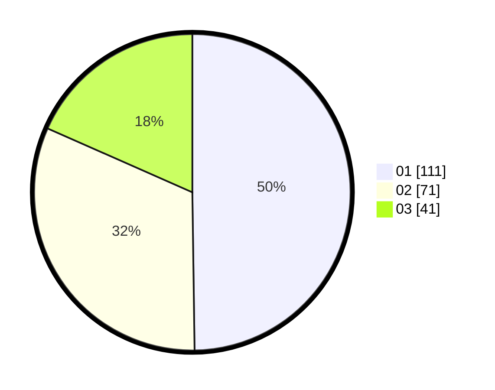

# Hasil

Hasil perolehan suara paslon dapat dilihat pada file paslon-01.txt, paslon-02.txt, dan paslon-03.txt.

Jika tidak ada, artinya data tersebut belum ada pada SIREKAP.

## Perolehan Suara

 * Paslon 01: **111**.
 * Paslon 02: **71**.
 * Paslon 03: **41**.

## Foto C Plano

https://sirekap-obj-formc.kpu.go.id/6e56/pemilu/ppwp/31/73/03/10/02/3173031002055-20240216-003602--5c432a16-aef8-46c1-b651-dba9cbef0b21.jpg

https://sirekap-obj-formc.kpu.go.id/6e56/pemilu/ppwp/31/73/03/10/02/3173031002055-20240216-003606--3ad5bf3e-0aa8-412d-98e1-2a9d46d13bda.jpg

https://sirekap-obj-formc.kpu.go.id/6e56/pemilu/ppwp/31/73/03/10/02/3173031002055-20240216-003604--d71c99a1-6ecd-4985-bac3-de51494cf2eb.jpg

## DATA PEMILIH TETAP

Jumlah pemilih dalam DPT: **294**.
 * L: **154**.
 * P: **140**.

## DATA PENGGUNA HAK PILIH

Jumlah pengguna hak pilih dalam DPT: **220**.
 * L: **111**.
 * P: **109**.

Jumlah pengguna hak pilih dalam DPTb: **3**.
 * L: **3**.
 * P: **0**.

Jumlah pengguna hak pilih dalam DPK: **2**.
 * L: **1**.
 * P: **1**.

Jumlah pengguna hak pilih: **225**.
 * L: **115**.
 * P: **110**.

## JUMLAH SUARA SAH DAN TIDAK SAH

JUMLAH SELURUH SUARA SAH: **223**.

JUMLAH SUARA TIDAK SAH: **2**.

JUMLAH SELURUH SUARA SAH DAN SUARA TIDAK SAH: **225**.
