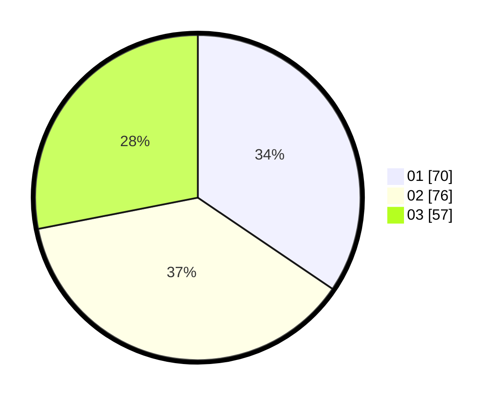

# Hasil

Hasil perolehan suara paslon dapat dilihat pada file paslon-01.txt, paslon-02.txt, dan paslon-03.txt.

Jika tidak ada, artinya data tersebut belum ada pada SIREKAP.

## Perolehan Suara

 * Paslon 01: **70**.
 * Paslon 02: **76**.
 * Paslon 03: **57**.

## Foto C Plano

https://sirekap-obj-formc.kpu.go.id/c7b8/pemilu/ppwp/31/73/03/10/02/3173031002063-20240214-232410--478d1cde-ea57-4427-8158-fe39ab34a05f.jpg

https://sirekap-obj-formc.kpu.go.id/c7b8/pemilu/ppwp/31/73/03/10/02/3173031002063-20240214-232515--0d560ff5-9fc6-4774-b57a-84615756ff14.jpg

https://sirekap-obj-formc.kpu.go.id/c7b8/pemilu/ppwp/31/73/03/10/02/3173031002063-20240214-231026--c3d20838-aedf-4370-9a0d-c99e09b16ba5.jpg
