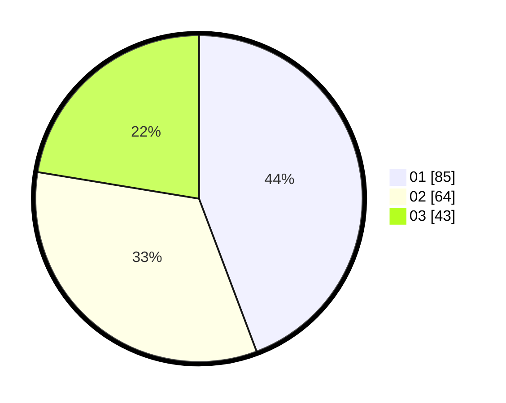

# Hasil

Hasil perolehan suara paslon dapat dilihat pada file paslon-01.txt, paslon-02.txt, dan paslon-03.txt.

Jika tidak ada, artinya data tersebut belum ada pada SIREKAP.

## Perolehan Suara

 * Paslon 01: **85**.
 * Paslon 02: **64**.
 * Paslon 03: **43**.

## Foto C Plano

https://sirekap-obj-formc.kpu.go.id/cfac/pemilu/ppwp/31/73/03/10/02/3173031002065-20240214-191351--3279b85b-7e98-47ff-ae9b-82cc3a8173a1.jpg

https://sirekap-obj-formc.kpu.go.id/cfac/pemilu/ppwp/31/73/03/10/02/3173031002065-20240214-191053--5745accb-f40a-45a2-90e3-a76ea45a7f25.jpg

https://sirekap-obj-formc.kpu.go.id/cfac/pemilu/ppwp/31/73/03/10/02/3173031002065-20240214-190932--9e01e157-bf49-42f8-a8ea-744b9b02b123.jpg

## DATA PEMILIH TETAP

Jumlah pemilih dalam DPT: **246**.
 * L: **126**.
 * P: **120**.

## DATA PENGGUNA HAK PILIH

Jumlah pengguna hak pilih dalam DPT: **191**.
 * L: **101**.
 * P: **90**.

Jumlah pengguna hak pilih dalam DPTb: **2**.
 * L: **0**.
 * P: **2**.

Jumlah pengguna hak pilih dalam DPK: **0**.
 * L: **0**.
 * P: **0**.

Jumlah pengguna hak pilih: **193**.
 * L: **101**.
 * P: **92**.

## JUMLAH SUARA SAH DAN TIDAK SAH

JUMLAH SELURUH SUARA SAH: **192**.

JUMLAH SUARA TIDAK SAH: **1**.

JUMLAH SELURUH SUARA SAH DAN SUARA TIDAK SAH: **193**.
