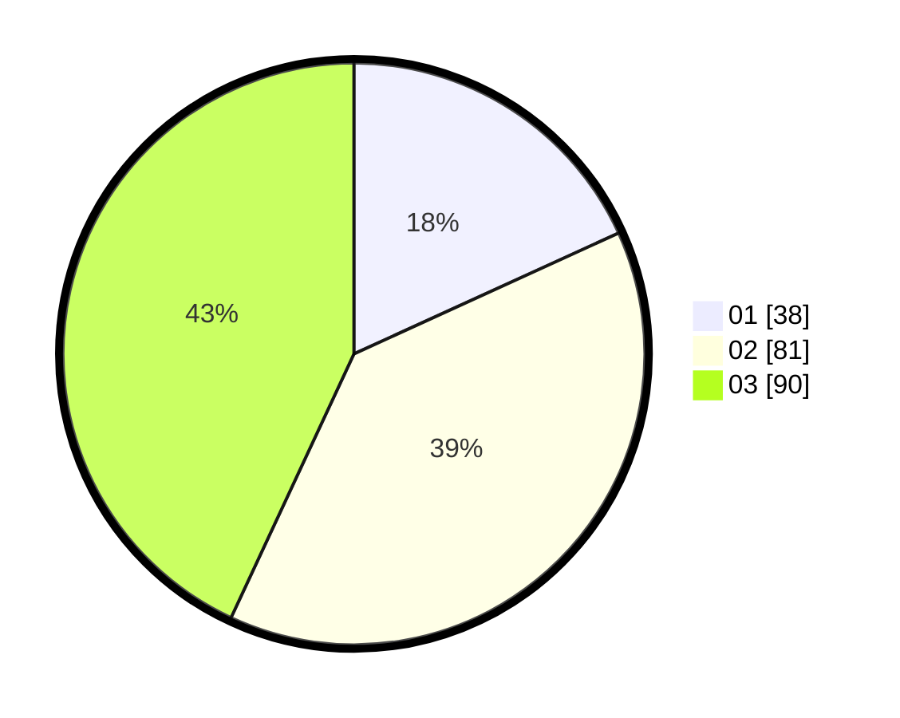

# Hasil

Hasil perolehan suara paslon dapat dilihat pada file paslon-01.txt, paslon-02.txt, dan paslon-03.txt.

Jika tidak ada, artinya data tersebut belum ada pada SIREKAP.

## Perolehan Suara

 * Paslon 01: **38**.
 * Paslon 02: **81**.
 * Paslon 03: **90**.

## Foto C Plano

https://sirekap-obj-formc.kpu.go.id/cd52/pemilu/ppwp/31/73/03/10/03/3173031003003-20240214-220521--e7c1d8dd-9b20-40a1-848c-1450ed0511db.jpg

https://sirekap-obj-formc.kpu.go.id/cd52/pemilu/ppwp/31/73/03/10/03/3173031003003-20240214-220702--da863f6c-26b8-41f7-9753-8c6bde6d39a2.jpg

https://sirekap-obj-formc.kpu.go.id/cd52/pemilu/ppwp/31/73/03/10/03/3173031003003-20240214-220817--db3ca8d0-33c5-49d4-b38f-320986d5faaa.jpg
