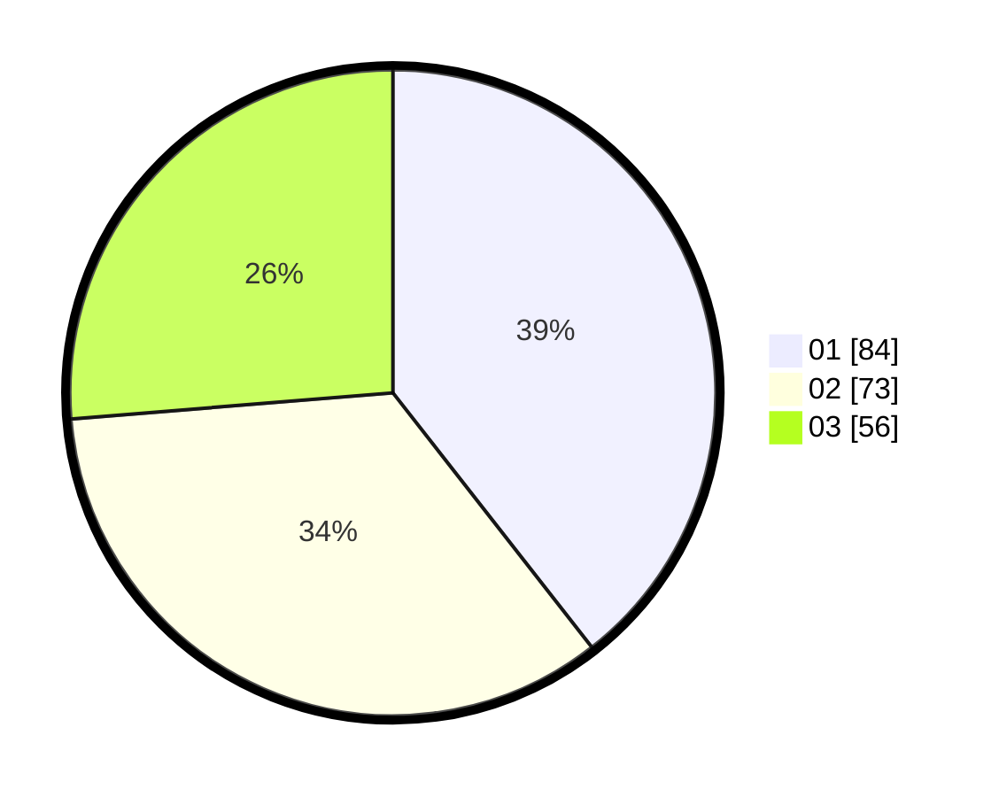

# Hasil

Hasil perolehan suara paslon dapat dilihat pada file paslon-01.txt, paslon-02.txt, dan paslon-03.txt.

Jika tidak ada, artinya data tersebut belum ada pada SIREKAP.

## Perolehan Suara

 * Paslon 01: **84**.
 * Paslon 02: **73**.
 * Paslon 03: **56**.

## Foto C Plano

https://sirekap-obj-formc.kpu.go.id/2e12/pemilu/ppwp/31/73/03/10/03/3173031003004-20240214-223619--aa6064a4-5a89-4e10-ae88-119c209d7c38.jpg

https://sirekap-obj-formc.kpu.go.id/2e12/pemilu/ppwp/31/73/03/10/03/3173031003004-20240214-223700--6b4a3e28-38f3-45ff-94d6-dea048b0417f.jpg

https://sirekap-obj-formc.kpu.go.id/2e12/pemilu/ppwp/31/73/03/10/03/3173031003004-20240214-223749--79b63e74-7069-48c5-9b23-56e2a8a75753.jpg
