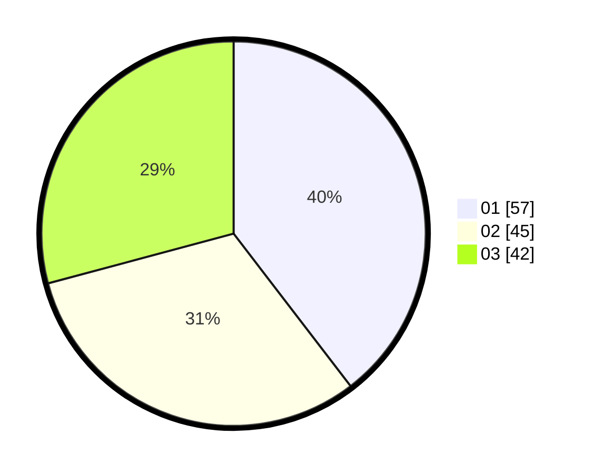

# Hasil

Hasil perolehan suara paslon dapat dilihat pada file paslon-01.txt, paslon-02.txt, dan paslon-03.txt.

Jika tidak ada, artinya data tersebut belum ada pada SIREKAP.

## Perolehan Suara

 * Paslon 01: **57**.
 * Paslon 02: **45**.
 * Paslon 03: **42**.

## Foto C Plano

https://sirekap-obj-formc.kpu.go.id/20fc/pemilu/ppwp/31/73/03/10/03/3173031003011-20240216-145109--32f14985-2c39-4594-af16-1d5927fd1d36.jpg

https://sirekap-obj-formc.kpu.go.id/20fc/pemilu/ppwp/31/73/03/10/03/3173031003011-20240216-145111--ecaf8911-c87f-426d-8226-5ccce477addb.jpg

https://sirekap-obj-formc.kpu.go.id/20fc/pemilu/ppwp/31/73/03/10/03/3173031003011-20240216-145110--f851e117-7683-4422-aefb-2fbd1d37cf47.jpg

## DATA PEMILIH TETAP

Jumlah pemilih dalam DPT: **199**.
 * L: **92**.
 * P: **107**.

## DATA PENGGUNA HAK PILIH

Jumlah pengguna hak pilih dalam DPT: **140**.
 * L: **60**.
 * P: **80**.

Jumlah pengguna hak pilih dalam DPTb: **3**.
 * L: **1**.
 * P: **2**.

Jumlah pengguna hak pilih dalam DPK: **3**.
 * L: **1**.
 * P: **2**.

Jumlah pengguna hak pilih: **146**.
 * L: **62**.
 * P: **84**.

## JUMLAH SUARA SAH DAN TIDAK SAH

JUMLAH SELURUH SUARA SAH: **144**.

JUMLAH SUARA TIDAK SAH: **2**.

JUMLAH SELURUH SUARA SAH DAN SUARA TIDAK SAH: **146**.
