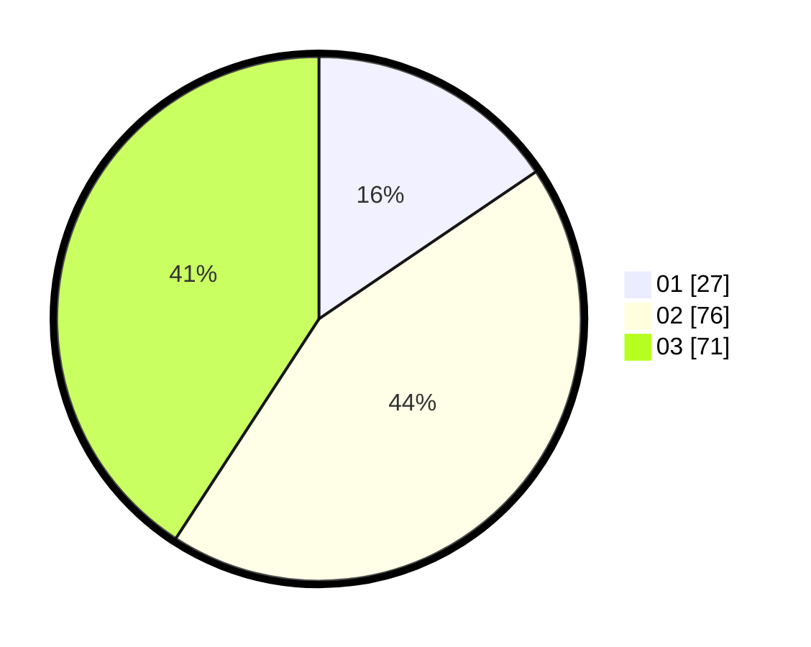

# Hasil

Hasil perolehan suara paslon dapat dilihat pada file paslon-01.txt, paslon-02.txt, dan paslon-03.txt.

Jika tidak ada, artinya data tersebut belum ada pada SIREKAP.

## Perolehan Suara

 * Paslon 01: **27**.
 * Paslon 02: **76**.
 * Paslon 03: **71**.

## Foto C Plano

https://sirekap-obj-formc.kpu.go.id/adc0/pemilu/ppwp/31/73/03/10/03/3173031003017-20240215-001055--9f48239c-2a27-415c-a5d5-79e770c3053a.jpg

https://sirekap-obj-formc.kpu.go.id/adc0/pemilu/ppwp/31/73/03/10/03/3173031003017-20240215-001254--a26188b2-e06d-496a-8352-ab5caf0a3b76.jpg

https://sirekap-obj-formc.kpu.go.id/adc0/pemilu/ppwp/31/73/03/10/03/3173031003017-20240215-001332--3503e13d-bde9-4787-bbde-68056f9e2d37.jpg
