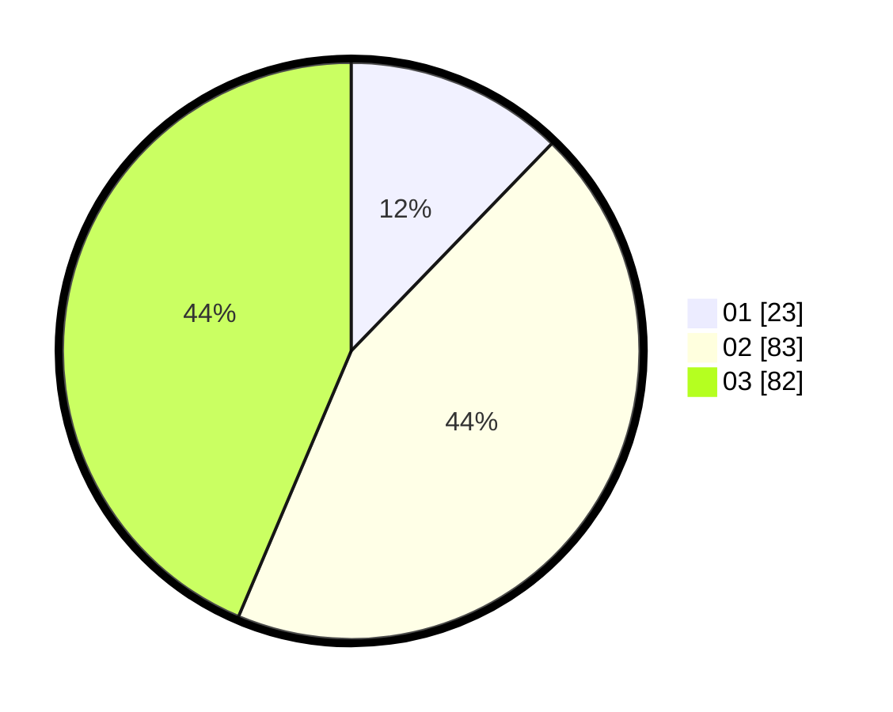

# Hasil

Hasil perolehan suara paslon dapat dilihat pada file paslon-01.txt, paslon-02.txt, dan paslon-03.txt.

Jika tidak ada, artinya data tersebut belum ada pada SIREKAP.

## Perolehan Suara

 * Paslon 01: **23**.
 * Paslon 02: **83**.
 * Paslon 03: **82**.

## Foto C Plano

https://sirekap-obj-formc.kpu.go.id/9252/pemilu/ppwp/31/73/03/10/03/3173031003019-20240214-193053--eaae300e-c098-4f81-bd48-41be181ce147.jpg

https://sirekap-obj-formc.kpu.go.id/9252/pemilu/ppwp/31/73/03/10/03/3173031003019-20240214-193355--fcb0fce3-d09a-4492-9f23-9fe77f6f06d0.jpg

https://sirekap-obj-formc.kpu.go.id/9252/pemilu/ppwp/31/73/03/10/03/3173031003019-20240214-193501--1431bcaa-4bbc-469a-addc-2fcd8ceac7cf.jpg
