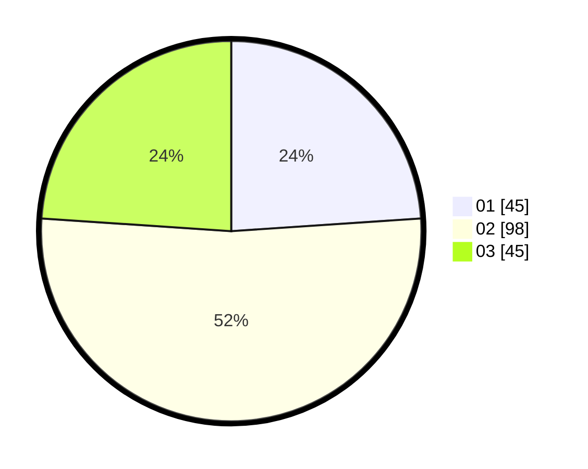

# Hasil

Hasil perolehan suara paslon dapat dilihat pada file paslon-01.txt, paslon-02.txt, dan paslon-03.txt.

Jika tidak ada, artinya data tersebut belum ada pada SIREKAP.

## Perolehan Suara

 * Paslon 01: **45**.
 * Paslon 02: **98**.
 * Paslon 03: **45**.

## Foto C Plano

https://sirekap-obj-formc.kpu.go.id/d229/pemilu/ppwp/31/73/03/10/03/3173031003021-20240214-190355--8acf0d60-3bbf-4797-b96f-e86dd73646b1.jpg

https://sirekap-obj-formc.kpu.go.id/d229/pemilu/ppwp/31/73/03/10/03/3173031003021-20240214-222433--c68feb79-eef4-4b79-81f3-e059ae9c1dea.jpg

https://sirekap-obj-formc.kpu.go.id/d229/pemilu/ppwp/31/73/03/10/03/3173031003021-20240214-222609--665a4d8d-ecc2-4705-8b37-1d0f43ca431d.jpg

## DATA PEMILIH TETAP

Jumlah pemilih dalam DPT: **253**.
 * L: **125**.
 * P: **128**.

## DATA PENGGUNA HAK PILIH

Jumlah pengguna hak pilih dalam DPT: **186**.
 * L: **96**.
 * P: **90**.

Jumlah pengguna hak pilih dalam DPTb: **2**.
 * L: **2**.
 * P: **0**.

Jumlah pengguna hak pilih dalam DPK: **4**.
 * L: **1**.
 * P: **3**.

Jumlah pengguna hak pilih: **192**.
 * L: **99**.
 * P: **93**.

## JUMLAH SUARA SAH DAN TIDAK SAH

JUMLAH SELURUH SUARA SAH: **188**.

JUMLAH SUARA TIDAK SAH: **4**.

JUMLAH SELURUH SUARA SAH DAN SUARA TIDAK SAH: **192**.
