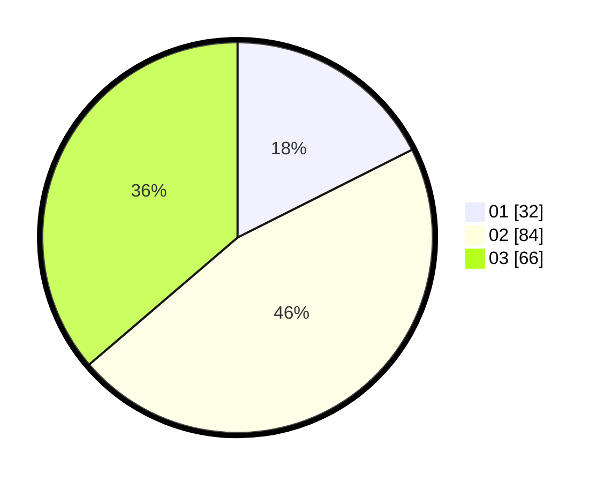

# Hasil

Hasil perolehan suara paslon dapat dilihat pada file paslon-01.txt, paslon-02.txt, dan paslon-03.txt.

Jika tidak ada, artinya data tersebut belum ada pada SIREKAP.

## Perolehan Suara

 * Paslon 01: **32**.
 * Paslon 02: **84**.
 * Paslon 03: **66**.

## Foto C Plano

https://sirekap-obj-formc.kpu.go.id/e73e/pemilu/ppwp/31/73/03/10/03/3173031003022-20240218-211052--42a1c261-fcd5-4a46-9fde-8532505c2d7f.jpg

https://sirekap-obj-formc.kpu.go.id/e73e/pemilu/ppwp/31/73/03/10/03/3173031003022-20240214-220220--c7b62fe1-d4e1-4232-b113-c2eb0f8ea5cb.jpg

https://sirekap-obj-formc.kpu.go.id/e73e/pemilu/ppwp/31/73/03/10/03/3173031003022-20240214-215956--c3a417cc-1abe-462f-8b18-1a32381a4618.jpg
