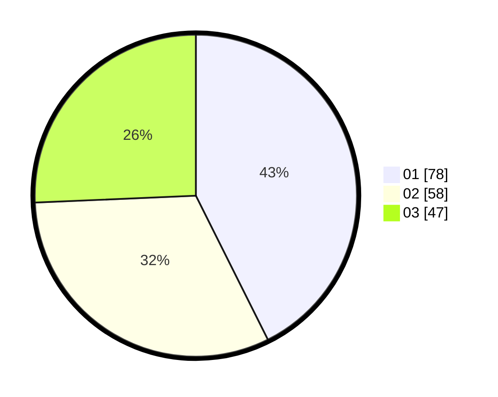

# Hasil

Hasil perolehan suara paslon dapat dilihat pada file paslon-01.txt, paslon-02.txt, dan paslon-03.txt.

Jika tidak ada, artinya data tersebut belum ada pada SIREKAP.

## Perolehan Suara

 * Paslon 01: **78**.
 * Paslon 02: **58**.
 * Paslon 03: **47**.

## Foto C Plano

https://sirekap-obj-formc.kpu.go.id/2a31/pemilu/ppwp/31/73/03/10/03/3173031003025-20240214-231619--4dcaa5eb-4a00-4192-83d6-2d33e4c98288.jpg

https://sirekap-obj-formc.kpu.go.id/2a31/pemilu/ppwp/31/73/03/10/03/3173031003025-20240214-231745--3c3f4318-4dec-499c-b355-bab7e57dfe14.jpg

https://sirekap-obj-formc.kpu.go.id/2a31/pemilu/ppwp/31/73/03/10/03/3173031003025-20240214-231919--083591ee-f17b-4d2a-a5a1-9c52ecac24e0.jpg
