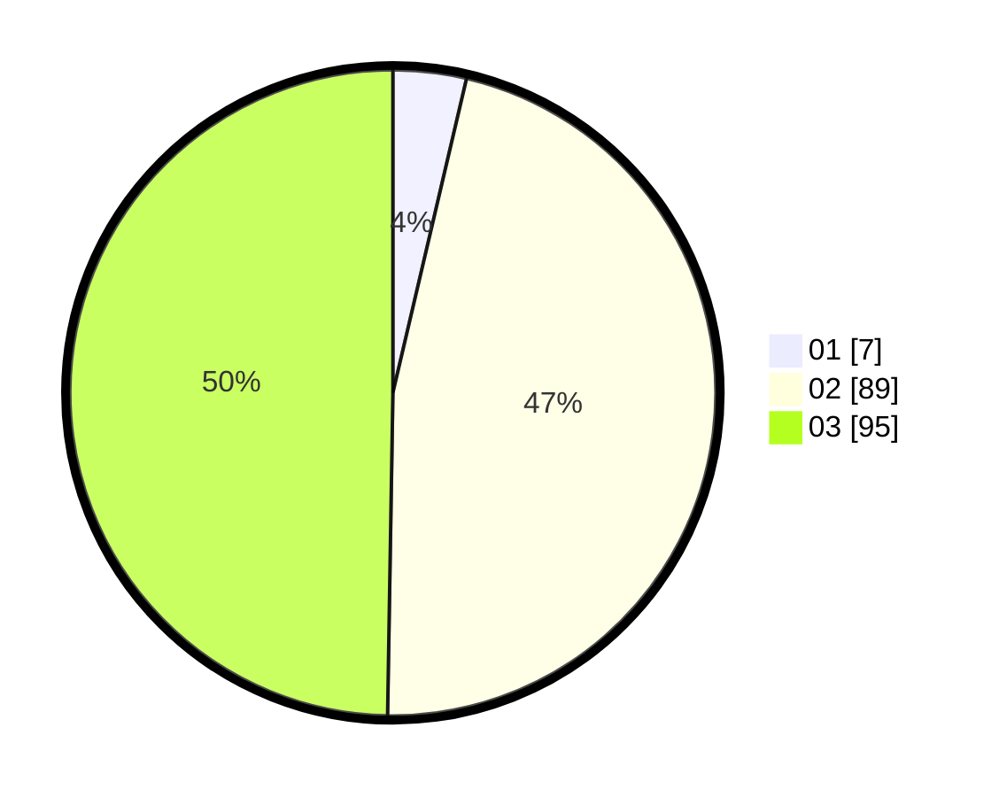

# Hasil

Hasil perolehan suara paslon dapat dilihat pada file paslon-01.txt, paslon-02.txt, dan paslon-03.txt.

Jika tidak ada, artinya data tersebut belum ada pada SIREKAP.

## Perolehan Suara

 * Paslon 01: **7**.
 * Paslon 02: **89**.
 * Paslon 03: **95**.

## Foto C Plano

https://sirekap-obj-formc.kpu.go.id/1875/pemilu/ppwp/31/73/03/10/03/3173031003033-20240216-013040--de1f1922-a0c2-4a1c-aadc-8856899938f7.jpg

https://sirekap-obj-formc.kpu.go.id/1875/pemilu/ppwp/31/73/03/10/03/3173031003033-20240216-015645--ba4baef2-ce4d-47bf-92f2-7f0b5fce6444.jpg

https://sirekap-obj-formc.kpu.go.id/1875/pemilu/ppwp/31/73/03/10/03/3173031003033-20240216-015644--16a0a86d-9493-4b7b-b40c-ef701368cfca.jpg

## DATA PEMILIH TETAP

Jumlah pemilih dalam DPT: **272**.
 * L: **135**.
 * P: **137**.

## DATA PENGGUNA HAK PILIH

Jumlah pengguna hak pilih dalam DPT: **192**.
 * L: **100**.
 * P: **92**.

Jumlah pengguna hak pilih dalam DPTb: **0**.
 * L: **0**.
 * P: **0**.

Jumlah pengguna hak pilih dalam DPK: **0**.
 * L: **0**.
 * P: **0**.

Jumlah pengguna hak pilih: **192**.
 * L: **100**.
 * P: **92**.

## JUMLAH SUARA SAH DAN TIDAK SAH

JUMLAH SELURUH SUARA SAH: **191**.

JUMLAH SUARA TIDAK SAH: **1**.

JUMLAH SELURUH SUARA SAH DAN SUARA TIDAK SAH: **192**.
