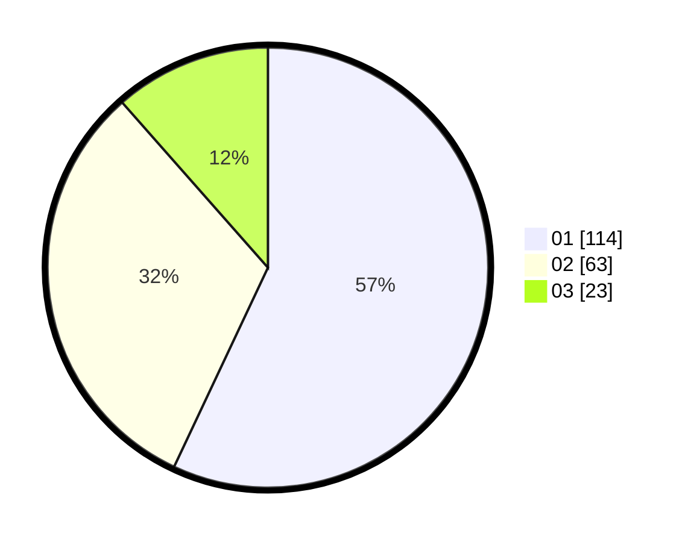

# Hasil

Hasil perolehan suara paslon dapat dilihat pada file paslon-01.txt, paslon-02.txt, dan paslon-03.txt.

Jika tidak ada, artinya data tersebut belum ada pada SIREKAP.

## Perolehan Suara

 * Paslon 01: **114**.
 * Paslon 02: **63**.
 * Paslon 03: **23**.

## Foto C Plano

https://sirekap-obj-formc.kpu.go.id/3b8a/pemilu/ppwp/31/73/03/10/03/3173031003037-20240214-155041--bbdd3d96-a3f0-4a28-bc5a-282d7c9f80aa.jpg

https://sirekap-obj-formc.kpu.go.id/3b8a/pemilu/ppwp/31/73/03/10/03/3173031003037-20240214-155749--7cecaa4f-7959-4c18-b21f-504cbd581c1a.jpg

https://sirekap-obj-formc.kpu.go.id/3b8a/pemilu/ppwp/31/73/03/10/03/3173031003037-20240214-155611--d55b88e0-0aed-44cc-8d0b-7d5998a174c3.jpg

## DATA PEMILIH TETAP

Jumlah pemilih dalam DPT: **277**.
 * L: **150**.
 * P: **120**.

## DATA PENGGUNA HAK PILIH

Jumlah pengguna hak pilih dalam DPT: **201**.
 * L: **107**.
 * P: **94**.

Jumlah pengguna hak pilih dalam DPTb: **0**.
 * L: **0**.
 * P: **0**.

Jumlah pengguna hak pilih dalam DPK: **1**.
 * L: **1**.
 * P: **0**.

Jumlah pengguna hak pilih: **202**.
 * L: **108**.
 * P: **94**.

## JUMLAH SUARA SAH DAN TIDAK SAH

JUMLAH SELURUH SUARA SAH: **200**.

JUMLAH SUARA TIDAK SAH: **2**.

JUMLAH SELURUH SUARA SAH DAN SUARA TIDAK SAH: **202**.
