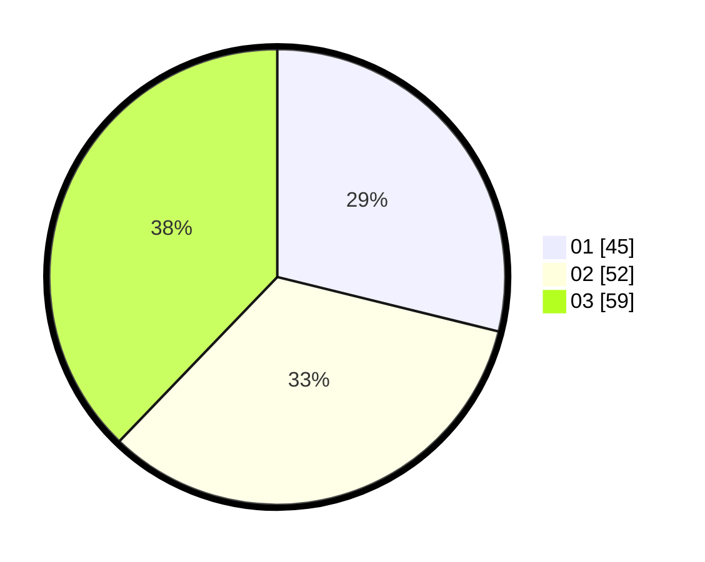

# Hasil

Hasil perolehan suara paslon dapat dilihat pada file paslon-01.txt, paslon-02.txt, dan paslon-03.txt.

Jika tidak ada, artinya data tersebut belum ada pada SIREKAP.

## Perolehan Suara

 * Paslon 01: **45**.
 * Paslon 02: **52**.
 * Paslon 03: **59**.

## Foto C Plano

https://sirekap-obj-formc.kpu.go.id/c1fa/pemilu/ppwp/31/73/03/10/03/3173031003039-20240214-231430--bf1bb3b0-4e58-4a8d-91cd-ba561232e43e.jpg

https://sirekap-obj-formc.kpu.go.id/c1fa/pemilu/ppwp/31/73/03/10/03/3173031003039-20240214-231244--380fa460-54a8-48a2-97a7-fae12db2b791.jpg

https://sirekap-obj-formc.kpu.go.id/c1fa/pemilu/ppwp/31/73/03/10/03/3173031003039-20240214-223611--30f6cad1-6afb-4b3e-907e-8b09024d482d.jpg
