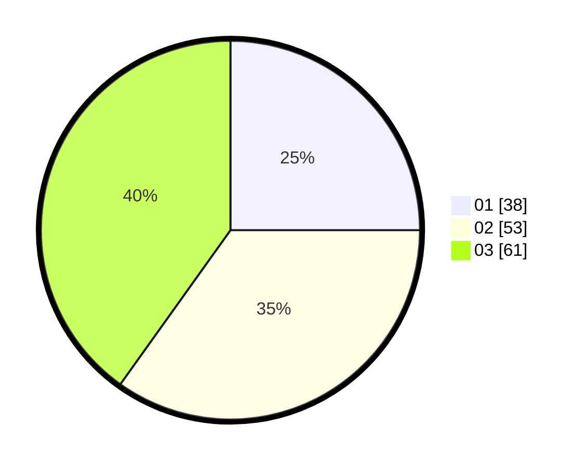

# Hasil

Hasil perolehan suara paslon dapat dilihat pada file paslon-01.txt, paslon-02.txt, dan paslon-03.txt.

Jika tidak ada, artinya data tersebut belum ada pada SIREKAP.

## Perolehan Suara

 * Paslon 01: **38**.
 * Paslon 02: **53**.
 * Paslon 03: **61**.

## Foto C Plano

https://sirekap-obj-formc.kpu.go.id/ba19/pemilu/ppwp/31/73/03/10/03/3173031003044-20240214-204947--5c0680cf-ed60-41a1-8126-98aa26f94a2c.jpg

https://sirekap-obj-formc.kpu.go.id/ba19/pemilu/ppwp/31/73/03/10/03/3173031003044-20240214-205112--74333f76-dd0d-4f94-a1b3-8044e87e49f4.jpg

https://sirekap-obj-formc.kpu.go.id/ba19/pemilu/ppwp/31/73/03/10/03/3173031003044-20240214-205212--ffae974c-2235-4bcc-a091-22da208471a6.jpg
