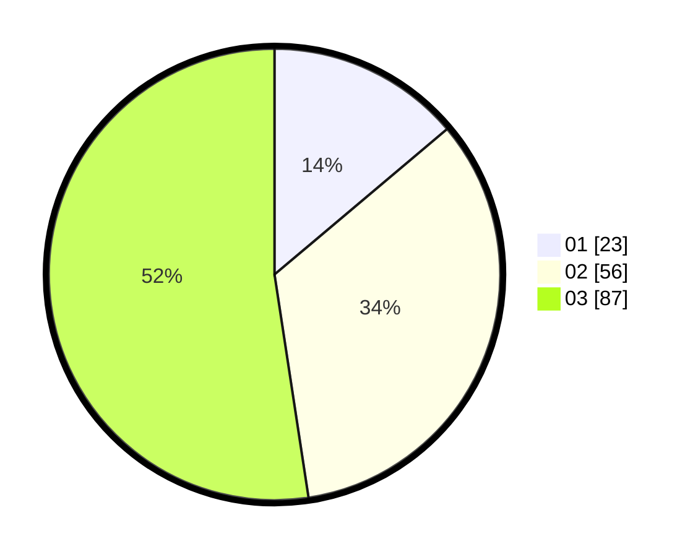

# Hasil

Hasil perolehan suara paslon dapat dilihat pada file paslon-01.txt, paslon-02.txt, dan paslon-03.txt.

Jika tidak ada, artinya data tersebut belum ada pada SIREKAP.

## Perolehan Suara

 * Paslon 01: **23**.
 * Paslon 02: **56**.
 * Paslon 03: **87**.

## Foto C Plano

https://sirekap-obj-formc.kpu.go.id/a87a/pemilu/ppwp/31/73/03/10/03/3173031003045-20240214-200500--70d86415-505c-48ac-9174-89f9fb58d670.jpg

https://sirekap-obj-formc.kpu.go.id/a87a/pemilu/ppwp/31/73/03/10/03/3173031003045-20240214-162237--e1a9fc51-8277-4f19-ac47-6318ab8fa433.jpg

https://sirekap-obj-formc.kpu.go.id/a87a/pemilu/ppwp/31/73/03/10/03/3173031003045-20240214-200516--1adbc0c5-8dac-440d-8855-f48ede5dfa91.jpg

## DATA PEMILIH TETAP

Jumlah pemilih dalam DPT: **286**.
 * L: **141**.
 * P: **145**.

## DATA PENGGUNA HAK PILIH

Jumlah pengguna hak pilih dalam DPT: **166**.
 * L: **76**.
 * P: **90**.

Jumlah pengguna hak pilih dalam DPTb: **2**.
 * L: **1**.
 * P: **1**.

Jumlah pengguna hak pilih dalam DPK: **3**.
 * L: **1**.
 * P: **2**.

Jumlah pengguna hak pilih: **171**.
 * L: **78**.
 * P: **93**.

## JUMLAH SUARA SAH DAN TIDAK SAH

JUMLAH SELURUH SUARA SAH: **166**.

JUMLAH SUARA TIDAK SAH: **5**.

JUMLAH SELURUH SUARA SAH DAN SUARA TIDAK SAH: **171**.
