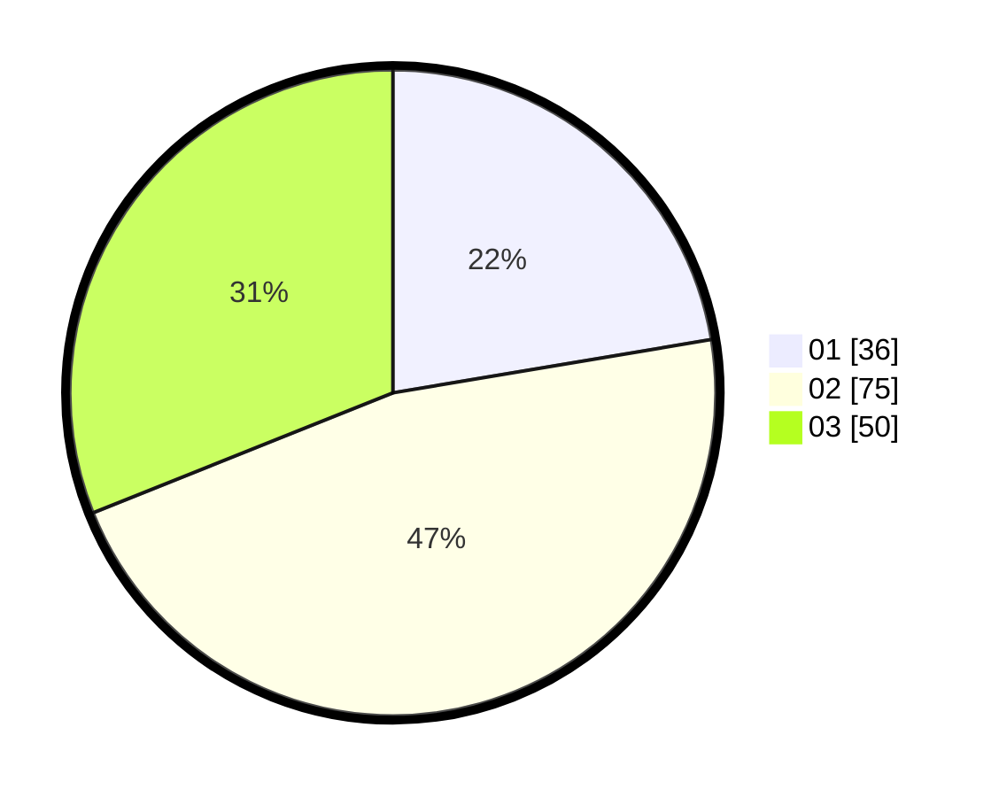

# Hasil

Hasil perolehan suara paslon dapat dilihat pada file paslon-01.txt, paslon-02.txt, dan paslon-03.txt.

Jika tidak ada, artinya data tersebut belum ada pada SIREKAP.

## Perolehan Suara

 * Paslon 01: **36**.
 * Paslon 02: **75**.
 * Paslon 03: **50**.

## Foto C Plano

https://sirekap-obj-formc.kpu.go.id/1ef1/pemilu/ppwp/31/73/03/10/03/3173031003047-20240214-234431--e2ef09c3-5e9d-4c1d-84a0-60c6e535cfe6.jpg

https://sirekap-obj-formc.kpu.go.id/1ef1/pemilu/ppwp/31/73/03/10/03/3173031003047-20240214-233650--10c0ed13-cf5a-4ff6-a5d4-4cd820dd0e5a.jpg

https://sirekap-obj-formc.kpu.go.id/1ef1/pemilu/ppwp/31/73/03/10/03/3173031003047-20240214-233800--8a78481c-f08c-4870-81d3-5a2032632daa.jpg
