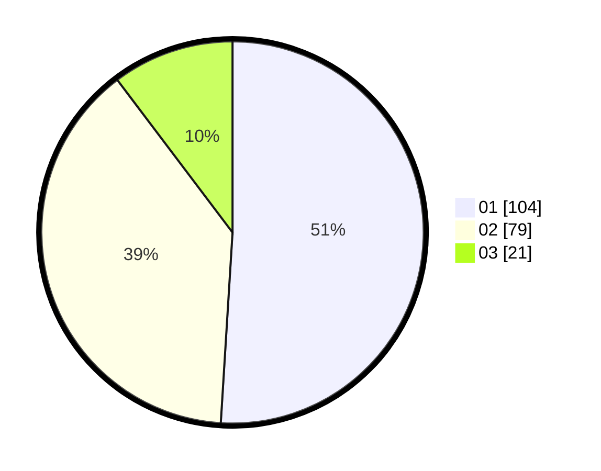

# Hasil

Hasil perolehan suara paslon dapat dilihat pada file paslon-01.txt, paslon-02.txt, dan paslon-03.txt.

Jika tidak ada, artinya data tersebut belum ada pada SIREKAP.

## Perolehan Suara

 * Paslon 01: **104**.
 * Paslon 02: **79**.
 * Paslon 03: **21**.

## Foto C Plano

https://sirekap-obj-formc.kpu.go.id/2d43/pemilu/ppwp/31/73/03/10/03/3173031003050-20240214-223439--bd371f4e-346c-4796-9eaa-237cea81731e.jpg

https://sirekap-obj-formc.kpu.go.id/2d43/pemilu/ppwp/31/73/03/10/03/3173031003050-20240214-223500--53e8d21c-8f29-459a-9778-6a18b43f5a8c.jpg

https://sirekap-obj-formc.kpu.go.id/2d43/pemilu/ppwp/31/73/03/10/03/3173031003050-20240214-223449--5b07771d-6c57-4ccd-9fd9-2365196c657f.jpg

## DATA PEMILIH TETAP

Jumlah pemilih dalam DPT: **265**.
 * L: **135**.
 * P: **130**.

## DATA PENGGUNA HAK PILIH

Jumlah pengguna hak pilih dalam DPT: **203**.
 * L: **97**.
 * P: **106**.

Jumlah pengguna hak pilih dalam DPTb: **0**.
 * L: **0**.
 * P: **0**.

Jumlah pengguna hak pilih dalam DPK: **4**.
 * L: **2**.
 * P: **2**.

Jumlah pengguna hak pilih: **207**.
 * L: **99**.
 * P: **108**.

## JUMLAH SUARA SAH DAN TIDAK SAH

JUMLAH SELURUH SUARA SAH: **204**.

JUMLAH SUARA TIDAK SAH: **3**.

JUMLAH SELURUH SUARA SAH DAN SUARA TIDAK SAH: **207**.
