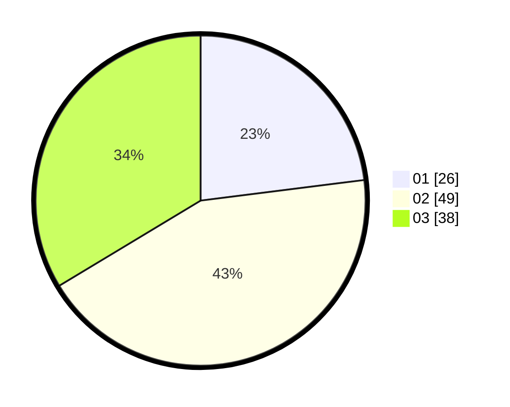

# Hasil

Hasil perolehan suara paslon dapat dilihat pada file paslon-01.txt, paslon-02.txt, dan paslon-03.txt.

Jika tidak ada, artinya data tersebut belum ada pada SIREKAP.

## Perolehan Suara

 * Paslon 01: **26**.
 * Paslon 02: **49**.
 * Paslon 03: **38**.

## Foto C Plano

https://sirekap-obj-formc.kpu.go.id/5609/pemilu/ppwp/31/73/03/10/03/3173031003056-20240214-210549--d90def37-4d4b-4f12-b1d9-377a07a90608.jpg

https://sirekap-obj-formc.kpu.go.id/5609/pemilu/ppwp/31/73/03/10/03/3173031003056-20240214-211043--848ec6bd-5ab1-46dc-a1dd-af71eb049cbf.jpg

https://sirekap-obj-formc.kpu.go.id/5609/pemilu/ppwp/31/73/03/10/03/3173031003056-20240214-210305--82f7e4ed-3f0f-4012-b62a-488975e59367.jpg

## DATA PEMILIH TETAP

Jumlah pemilih dalam DPT: **211**.
 * L: **114**.
 * P: **94**.

## DATA PENGGUNA HAK PILIH

Jumlah pengguna hak pilih dalam DPT: **116**.
 * L: **67**.
 * P: **45**.

Jumlah pengguna hak pilih dalam DPTb: **2**.
 * L: **2**.
 * P: **0**.

Jumlah pengguna hak pilih dalam DPK: **3**.
 * L: **2**.
 * P: **1**.

Jumlah pengguna hak pilih: **121**.
 * L: **71**.
 * P: **50**.

## JUMLAH SUARA SAH DAN TIDAK SAH

JUMLAH SELURUH SUARA SAH: **113**.

JUMLAH SUARA TIDAK SAH: **8**.

JUMLAH SELURUH SUARA SAH DAN SUARA TIDAK SAH: **121**.
