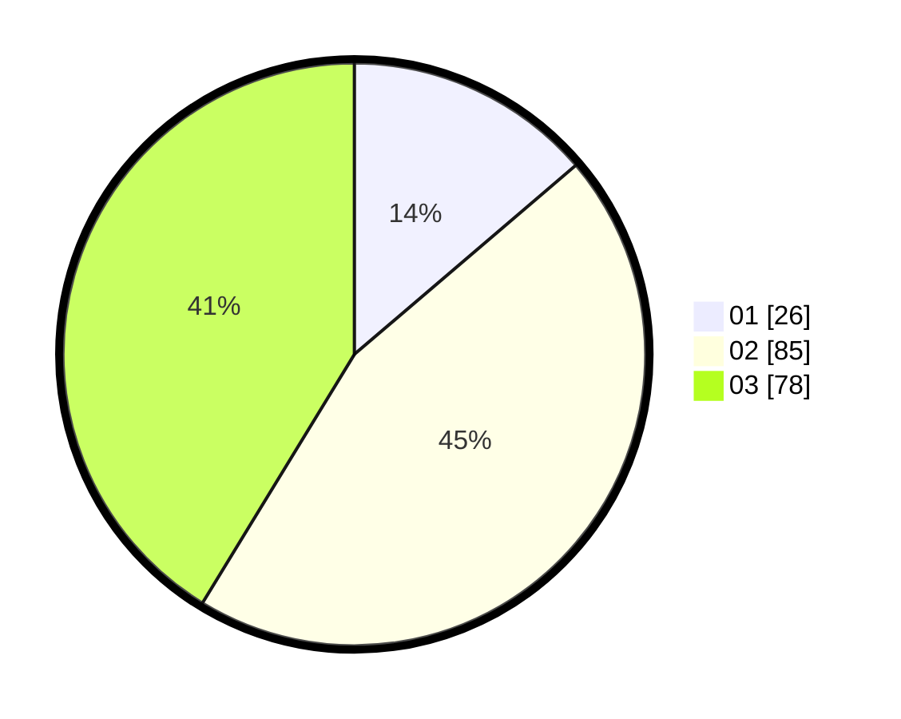

# Hasil

Hasil perolehan suara paslon dapat dilihat pada file paslon-01.txt, paslon-02.txt, dan paslon-03.txt.

Jika tidak ada, artinya data tersebut belum ada pada SIREKAP.

## Perolehan Suara

 * Paslon 01: **26**.
 * Paslon 02: **85**.
 * Paslon 03: **78**.

## Foto C Plano

https://sirekap-obj-formc.kpu.go.id/3771/pemilu/ppwp/31/73/03/10/04/3173031004001-20240214-221954--a9024098-71d0-4cd4-a009-b200e4e9da1f.jpg

https://sirekap-obj-formc.kpu.go.id/3771/pemilu/ppwp/31/73/03/10/04/3173031004001-20240214-204946--589cae75-bc9c-48f7-b941-6ba59e526742.jpg

https://sirekap-obj-formc.kpu.go.id/3771/pemilu/ppwp/31/73/03/10/04/3173031004001-20240214-205113--48b2c233-474f-4484-9f9e-698050974332.jpg

## DATA PEMILIH TETAP

Jumlah pemilih dalam DPT: **267**.
 * L: **137**.
 * P: **130**.

## DATA PENGGUNA HAK PILIH

Jumlah pengguna hak pilih dalam DPT: **187**.
 * L: **93**.
 * P: **94**.

Jumlah pengguna hak pilih dalam DPTb: **2**.
 * L: **0**.
 * P: **2**.

Jumlah pengguna hak pilih dalam DPK: **0**.
 * L: **0**.
 * P: **0**.

Jumlah pengguna hak pilih: **189**.
 * L: **93**.
 * P: **96**.

## JUMLAH SUARA SAH DAN TIDAK SAH

JUMLAH SELURUH SUARA SAH: **189**.

JUMLAH SUARA TIDAK SAH: **0**.

JUMLAH SELURUH SUARA SAH DAN SUARA TIDAK SAH: **189**.
