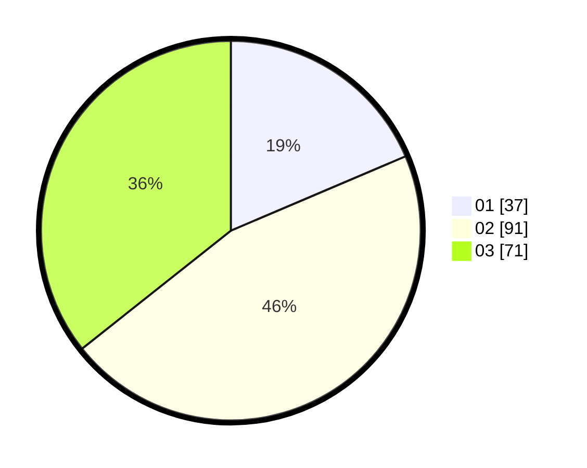

# Hasil

Hasil perolehan suara paslon dapat dilihat pada file paslon-01.txt, paslon-02.txt, dan paslon-03.txt.

Jika tidak ada, artinya data tersebut belum ada pada SIREKAP.

## Perolehan Suara

 * Paslon 01: **37**.
 * Paslon 02: **91**.
 * Paslon 03: **71**.

## Foto C Plano

https://sirekap-obj-formc.kpu.go.id/111b/pemilu/ppwp/31/73/03/10/04/3173031004004-20240218-130104--b4bb2230-dad1-42a2-8e7c-d502d2bc2456.jpg

https://sirekap-obj-formc.kpu.go.id/111b/pemilu/ppwp/31/73/03/10/04/3173031004004-20240218-130257--f3a6ca08-7d1d-48ba-8ba1-3992990ba291.jpg

https://sirekap-obj-formc.kpu.go.id/111b/pemilu/ppwp/31/73/03/10/04/3173031004004-20240218-130316--b0bd7d86-050a-4c42-bd74-160e8ba9fb9e.jpg

## DATA PEMILIH TETAP

Jumlah pemilih dalam DPT: **267**.
 * L: **124**.
 * P: **143**.

## DATA PENGGUNA HAK PILIH

Jumlah pengguna hak pilih dalam DPT: **198**.
 * L: **89**.
 * P: **109**.

Jumlah pengguna hak pilih dalam DPTb: **3**.
 * L: **1**.
 * P: **2**.

Jumlah pengguna hak pilih dalam DPK: **3**.
 * L: **0**.
 * P: **3**.

Jumlah pengguna hak pilih: **204**.
 * L: **90**.
 * P: **114**.

## JUMLAH SUARA SAH DAN TIDAK SAH

JUMLAH SELURUH SUARA SAH: **199**.

JUMLAH SUARA TIDAK SAH: **5**.

JUMLAH SELURUH SUARA SAH DAN SUARA TIDAK SAH: **204**.
