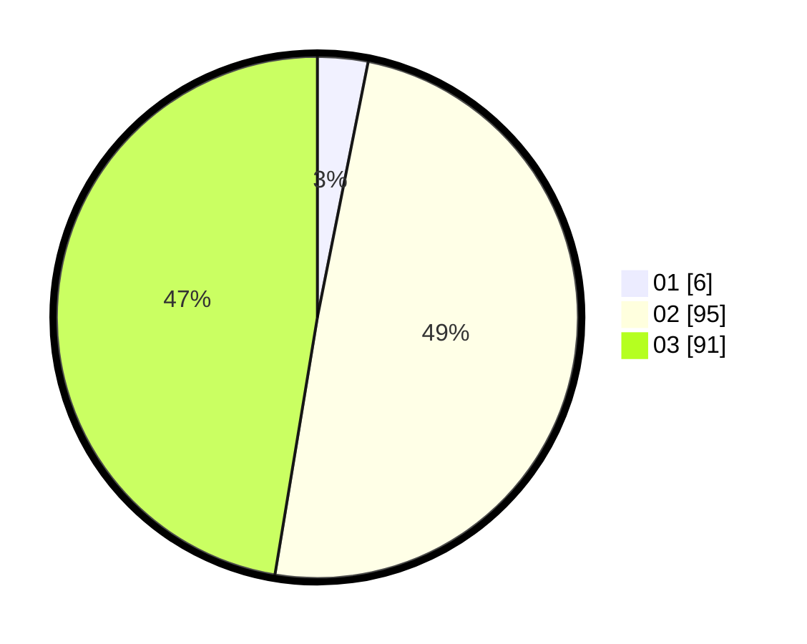

# Hasil

Hasil perolehan suara paslon dapat dilihat pada file paslon-01.txt, paslon-02.txt, dan paslon-03.txt.

Jika tidak ada, artinya data tersebut belum ada pada SIREKAP.

## Perolehan Suara

 * Paslon 01: **6**.
 * Paslon 02: **95**.
 * Paslon 03: **91**.

## Foto C Plano

https://sirekap-obj-formc.kpu.go.id/e0f2/pemilu/ppwp/31/73/03/10/04/3173031004005-20240215-000455--657474f3-46e6-4c5e-95ab-466e198c383e.jpg

https://sirekap-obj-formc.kpu.go.id/e0f2/pemilu/ppwp/31/73/03/10/04/3173031004005-20240215-000506--07f52d57-4411-4a9e-b8d0-09c8f86b1994.jpg

https://sirekap-obj-formc.kpu.go.id/e0f2/pemilu/ppwp/31/73/03/10/04/3173031004005-20240215-000558--0f196886-a149-46c1-a613-2c3f40adbfce.jpg
