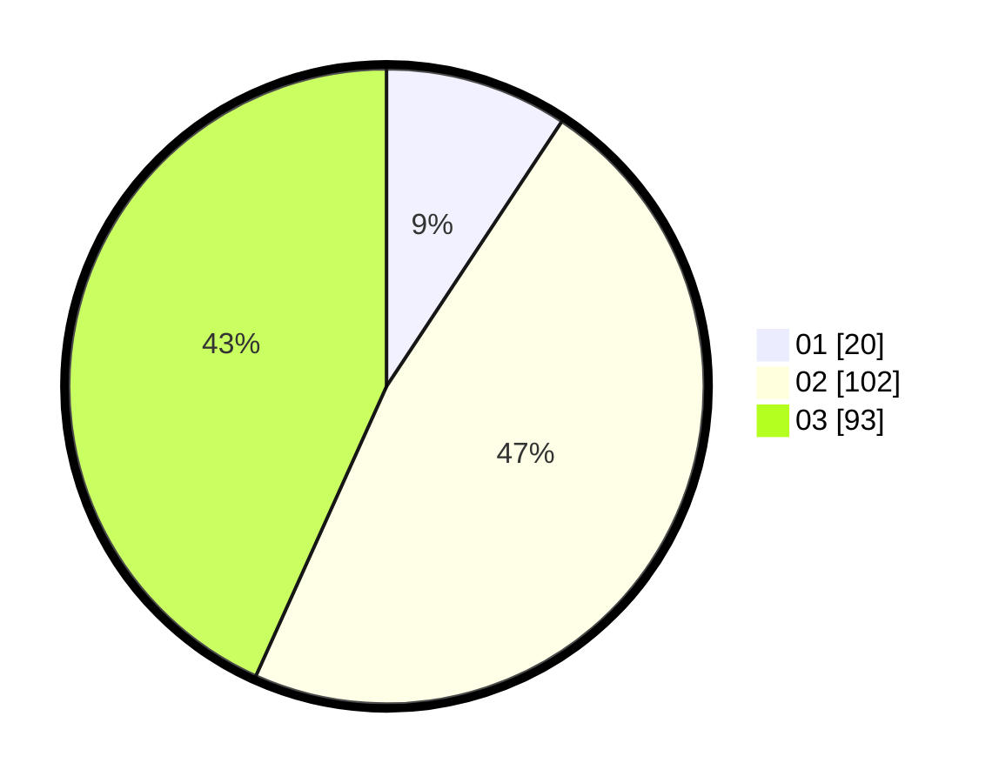

# Hasil

Hasil perolehan suara paslon dapat dilihat pada file paslon-01.txt, paslon-02.txt, dan paslon-03.txt.

Jika tidak ada, artinya data tersebut belum ada pada SIREKAP.

## Perolehan Suara

 * Paslon 01: **20**.
 * Paslon 02: **102**.
 * Paslon 03: **93**.

## Foto C Plano

https://sirekap-obj-formc.kpu.go.id/759c/pemilu/ppwp/31/73/03/10/04/3173031004009-20240214-155920--d017d9e5-5aa9-41f2-b27f-41e1f2a14226.jpg

https://sirekap-obj-formc.kpu.go.id/759c/pemilu/ppwp/31/73/03/10/04/3173031004009-20240214-160144--9f14d95c-0535-4ade-b7d8-328d85be4796.jpg

https://sirekap-obj-formc.kpu.go.id/759c/pemilu/ppwp/31/73/03/10/04/3173031004009-20240214-160144--5120ea47-e709-4b11-b4cb-9d60677136b0.jpg

## DATA PEMILIH TETAP

Jumlah pemilih dalam DPT: **265**.
 * L: **121**.
 * P: **144**.

## DATA PENGGUNA HAK PILIH

Jumlah pengguna hak pilih dalam DPT: **214**.
 * L: **96**.
 * P: **118**.

Jumlah pengguna hak pilih dalam DPTb: **1**.
 * L: **0**.
 * P: **1**.

Jumlah pengguna hak pilih dalam DPK: **2**.
 * L: **1**.
 * P: **1**.

Jumlah pengguna hak pilih: **217**.
 * L: **97**.
 * P: **120**.

## JUMLAH SUARA SAH DAN TIDAK SAH

JUMLAH SELURUH SUARA SAH: **215**.

JUMLAH SUARA TIDAK SAH: **2**.

JUMLAH SELURUH SUARA SAH DAN SUARA TIDAK SAH: **217**.
