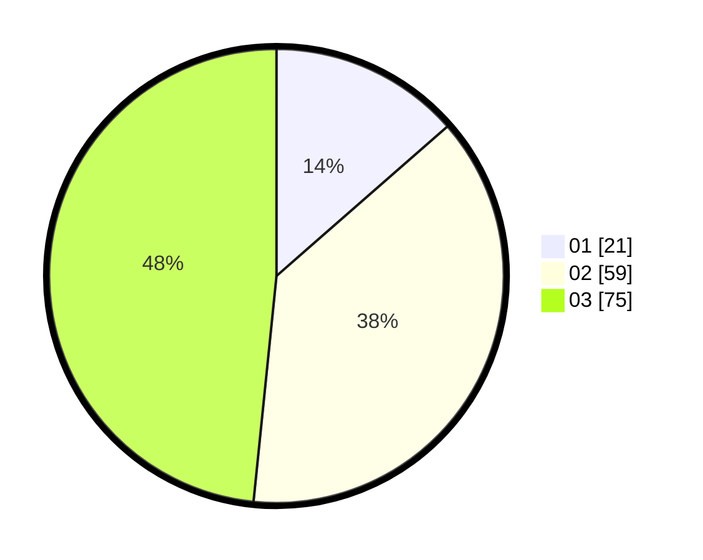

# Hasil

Hasil perolehan suara paslon dapat dilihat pada file paslon-01.txt, paslon-02.txt, dan paslon-03.txt.

Jika tidak ada, artinya data tersebut belum ada pada SIREKAP.

## Perolehan Suara

 * Paslon 01: **21**.
 * Paslon 02: **59**.
 * Paslon 03: **75**.

## Foto C Plano

https://sirekap-obj-formc.kpu.go.id/42f6/pemilu/ppwp/31/73/03/10/04/3173031004030-20240214-204143--1dabcc33-bb3b-4418-8605-6a0cbd5d7e2c.jpg

https://sirekap-obj-formc.kpu.go.id/42f6/pemilu/ppwp/31/73/03/10/04/3173031004030-20240214-205349--888b2aaf-3301-465a-a57c-71176945d0bb.jpg
