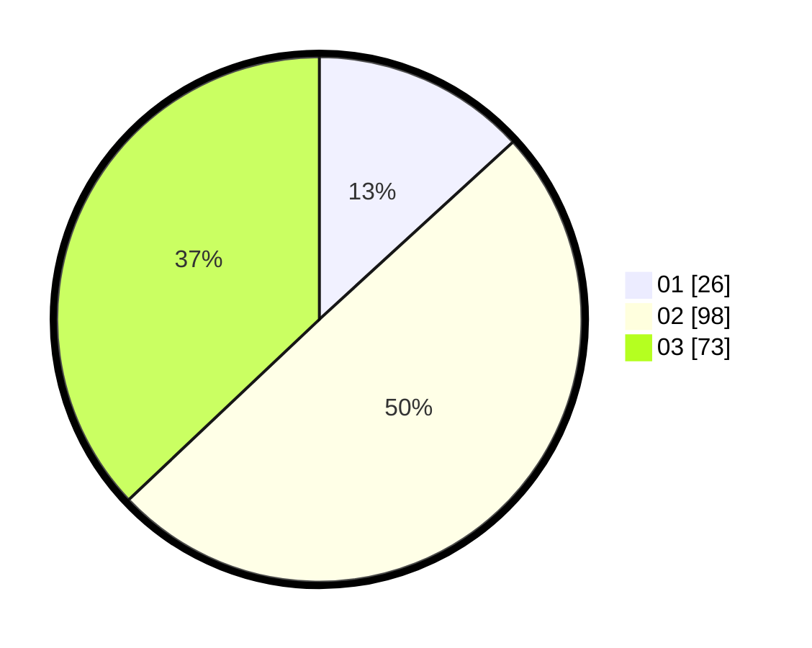

# Hasil

Hasil perolehan suara paslon dapat dilihat pada file paslon-01.txt, paslon-02.txt, dan paslon-03.txt.

Jika tidak ada, artinya data tersebut belum ada pada SIREKAP.

## Perolehan Suara

 * Paslon 01: **26**.
 * Paslon 02: **98**.
 * Paslon 03: **73**.

## Foto C Plano

https://sirekap-obj-formc.kpu.go.id/70be/pemilu/ppwp/31/73/03/10/04/3173031004041-20240215-023653--2ba329e4-bd79-440c-8284-3215e54f15fd.jpg

https://sirekap-obj-formc.kpu.go.id/70be/pemilu/ppwp/31/73/03/10/04/3173031004041-20240215-024256--66e5620a-ad6a-4b50-9c52-3cd67cd2ac99.jpg

https://sirekap-obj-formc.kpu.go.id/70be/pemilu/ppwp/31/73/03/10/04/3173031004041-20240214-233644--3dc227b3-3f3d-44e6-9bef-0e2e955817de.jpg
