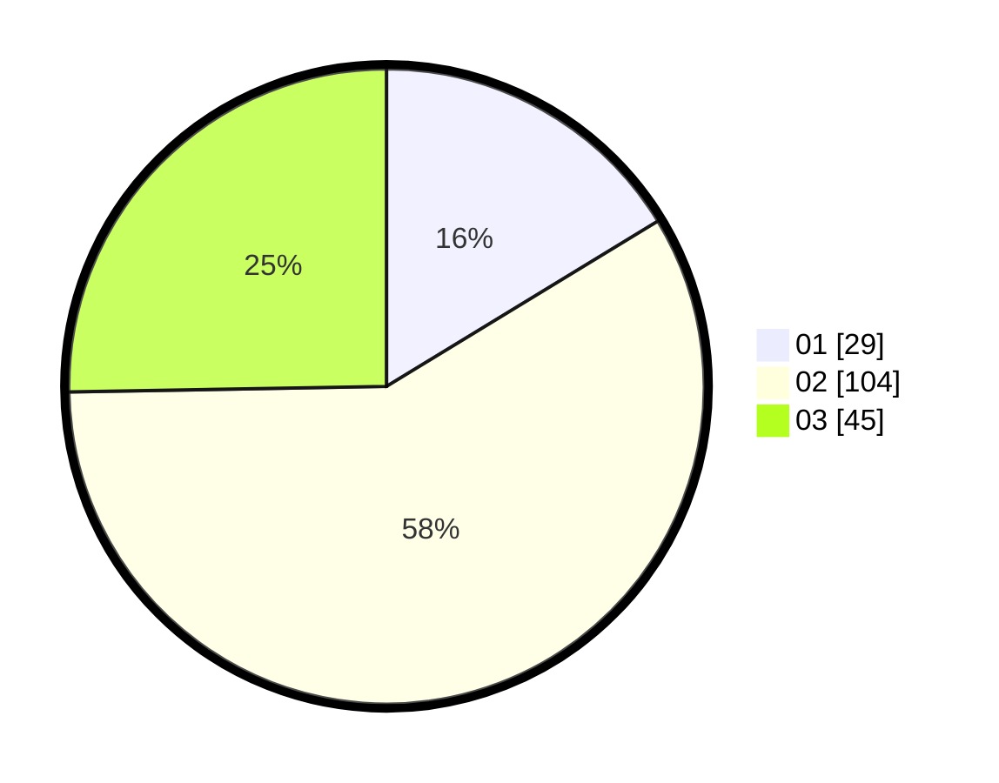

# Hasil

Hasil perolehan suara paslon dapat dilihat pada file paslon-01.txt, paslon-02.txt, dan paslon-03.txt.

Jika tidak ada, artinya data tersebut belum ada pada SIREKAP.

## Perolehan Suara

 * Paslon 01: **29**.
 * Paslon 02: **104**.
 * Paslon 03: **45**.

## Foto C Plano

https://sirekap-obj-formc.kpu.go.id/3a8c/pemilu/ppwp/31/73/03/10/04/3173031004042-20240214-211410--8d9aa45a-ff7f-4bdf-a5f5-dce30028c520.jpg

https://sirekap-obj-formc.kpu.go.id/3a8c/pemilu/ppwp/31/73/03/10/04/3173031004042-20240214-211545--af04cdb7-29b0-4074-9d8c-70d0e13ad179.jpg
