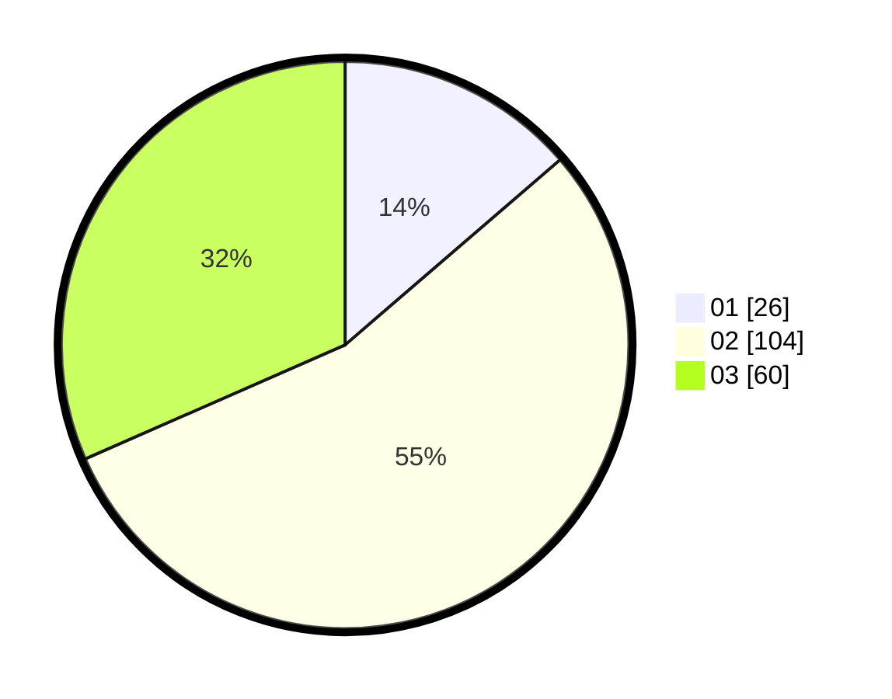

# Hasil

Hasil perolehan suara paslon dapat dilihat pada file paslon-01.txt, paslon-02.txt, dan paslon-03.txt.

Jika tidak ada, artinya data tersebut belum ada pada SIREKAP.

## Perolehan Suara

 * Paslon 01: **26**.
 * Paslon 02: **104**.
 * Paslon 03: **60**.

## Foto C Plano

https://sirekap-obj-formc.kpu.go.id/8e59/pemilu/ppwp/31/73/03/10/04/3173031004045-20240215-173742--3e5b35a4-e0c2-400b-87b6-b19076bf15da.jpg

https://sirekap-obj-formc.kpu.go.id/8e59/pemilu/ppwp/31/73/03/10/04/3173031004045-20240215-174437--d7f9deaf-76e1-4bcb-b5e9-98927a25f347.jpg

https://sirekap-obj-formc.kpu.go.id/8e59/pemilu/ppwp/31/73/03/10/04/3173031004045-20240214-214018--f214c945-5ce0-43d2-81f8-3a27b030a9bd.jpg
