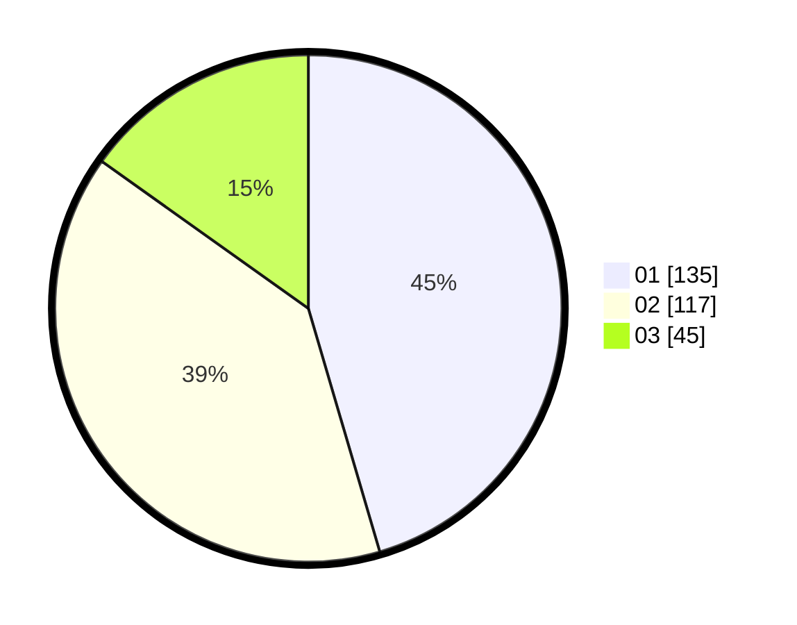

# Hasil

Hasil perolehan suara paslon dapat dilihat pada file paslon-01.txt, paslon-02.txt, dan paslon-03.txt.

Jika tidak ada, artinya data tersebut belum ada pada SIREKAP.

## Perolehan Suara

 * Paslon 01: **135**.
 * Paslon 02: **117**.
 * Paslon 03: **45**.

## Foto C Plano

https://sirekap-obj-formc.kpu.go.id/ce75/pemilu/ppwp/31/73/03/10/04/3173031004047-20240216-224319--0b212cdd-ede9-4fc0-a208-ef640a631b41.jpg

https://sirekap-obj-formc.kpu.go.id/ce75/pemilu/ppwp/31/73/03/10/04/3173031004047-20240216-224320--1cb09737-62d8-4004-90c3-058c12de63af.jpg

https://sirekap-obj-formc.kpu.go.id/ce75/pemilu/ppwp/31/73/03/10/04/3173031004047-20240216-224320--fd9e886e-49f3-4c52-ba36-3ff362c7d2a9.jpg

## DATA PEMILIH TETAP

Jumlah pemilih dalam DPT: **249**.
 * L: **121**.
 * P: **128**.

## DATA PENGGUNA HAK PILIH

Jumlah pengguna hak pilih dalam DPT: **193**.
 * L: **92**.
 * P: **101**.

Jumlah pengguna hak pilih dalam DPTb: **2**.
 * L: **2**.
 * P: **0**.

Jumlah pengguna hak pilih dalam DPK: **3**.
 * L: **1**.
 * P: **2**.

Jumlah pengguna hak pilih: **198**.
 * L: **95**.
 * P: **103**.

## JUMLAH SUARA SAH DAN TIDAK SAH

JUMLAH SELURUH SUARA SAH: **197**.

JUMLAH SUARA TIDAK SAH: **1**.

JUMLAH SELURUH SUARA SAH DAN SUARA TIDAK SAH: **198**.
