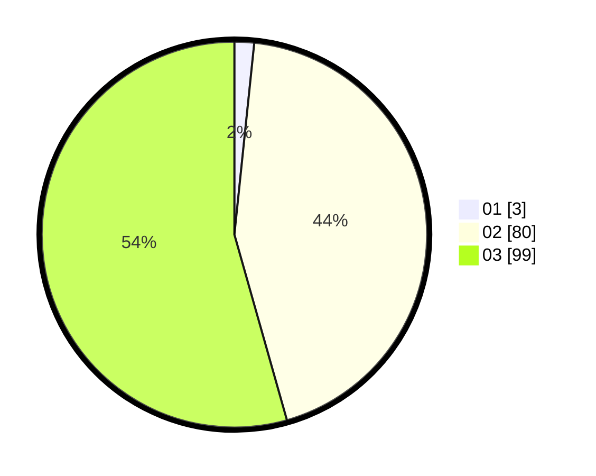

# Hasil

Hasil perolehan suara paslon dapat dilihat pada file paslon-01.txt, paslon-02.txt, dan paslon-03.txt.

Jika tidak ada, artinya data tersebut belum ada pada SIREKAP.

## Perolehan Suara

 * Paslon 01: **3**.
 * Paslon 02: **80**.
 * Paslon 03: **99**.

## Foto C Plano

https://sirekap-obj-formc.kpu.go.id/7562/pemilu/ppwp/31/73/03/10/05/3173031005001-20240215-235815--32a18fa3-a1dd-4837-9882-195a8104e965.jpg

https://sirekap-obj-formc.kpu.go.id/7562/pemilu/ppwp/31/73/03/10/05/3173031005001-20240215-235817--f39e7064-051a-430d-a34e-a58968d893cc.jpg

https://sirekap-obj-formc.kpu.go.id/7562/pemilu/ppwp/31/73/03/10/05/3173031005001-20240215-235816--9631051b-60e6-4d0c-b952-1a900fca4c1c.jpg

## DATA PEMILIH TETAP

Jumlah pemilih dalam DPT: **238**.
 * L: **111**.
 * P: **127**.

## DATA PENGGUNA HAK PILIH

Jumlah pengguna hak pilih dalam DPT: **182**.
 * L: **89**.
 * P: **93**.

Jumlah pengguna hak pilih dalam DPTb: **0**.
 * L: **0**.
 * P: **0**.

Jumlah pengguna hak pilih dalam DPK: **3**.
 * L: **2**.
 * P: **1**.

Jumlah pengguna hak pilih: **185**.
 * L: **91**.
 * P: **94**.

## JUMLAH SUARA SAH DAN TIDAK SAH

JUMLAH SELURUH SUARA SAH: **182**.

JUMLAH SUARA TIDAK SAH: **3**.

JUMLAH SELURUH SUARA SAH DAN SUARA TIDAK SAH: **185**.
