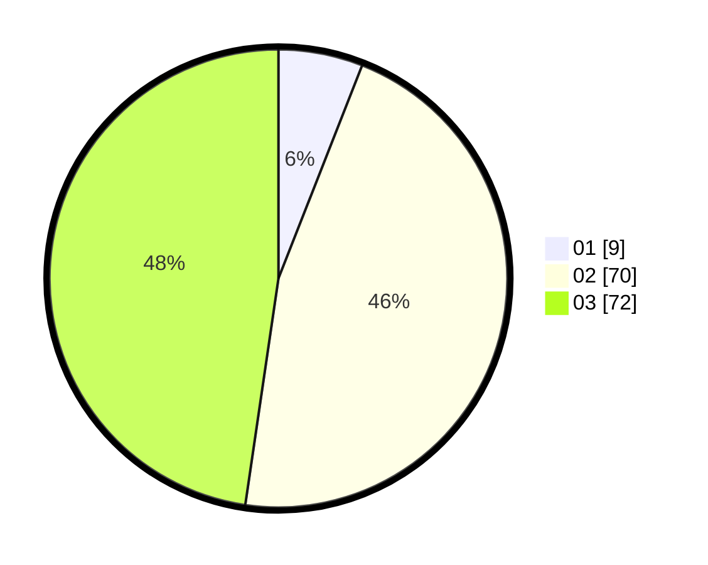

# Hasil

Hasil perolehan suara paslon dapat dilihat pada file paslon-01.txt, paslon-02.txt, dan paslon-03.txt.

Jika tidak ada, artinya data tersebut belum ada pada SIREKAP.

## Perolehan Suara

 * Paslon 01: **9**.
 * Paslon 02: **70**.
 * Paslon 03: **72**.

## Foto C Plano

https://sirekap-obj-formc.kpu.go.id/bfc3/pemilu/ppwp/31/73/03/10/05/3173031005003-20240214-201102--9e6c0925-a9e4-403e-aa97-0eaa072bbb14.jpg

https://sirekap-obj-formc.kpu.go.id/bfc3/pemilu/ppwp/31/73/03/10/05/3173031005003-20240214-203232--a942c35e-c27c-47bb-afb8-88aa7874666d.jpg

https://sirekap-obj-formc.kpu.go.id/bfc3/pemilu/ppwp/31/73/03/10/05/3173031005003-20240214-201224--369e2c6d-d91c-4c51-9b9e-06ee9604bae7.jpg

## DATA PEMILIH TETAP

Jumlah pemilih dalam DPT: **220**.
 * L: **105**.
 * P: **115**.

## DATA PENGGUNA HAK PILIH

Jumlah pengguna hak pilih dalam DPT: **147**.
 * L: **70**.
 * P: **77**.

Jumlah pengguna hak pilih dalam DPTb: **4**.
 * L: **1**.
 * P: **3**.

Jumlah pengguna hak pilih dalam DPK: **0**.
 * L: **0**.
 * P: **0**.

Jumlah pengguna hak pilih: **151**.
 * L: **71**.
 * P: **80**.

## JUMLAH SUARA SAH DAN TIDAK SAH

JUMLAH SELURUH SUARA SAH: **151**.

JUMLAH SUARA TIDAK SAH: **0**.

JUMLAH SELURUH SUARA SAH DAN SUARA TIDAK SAH: **151**.
