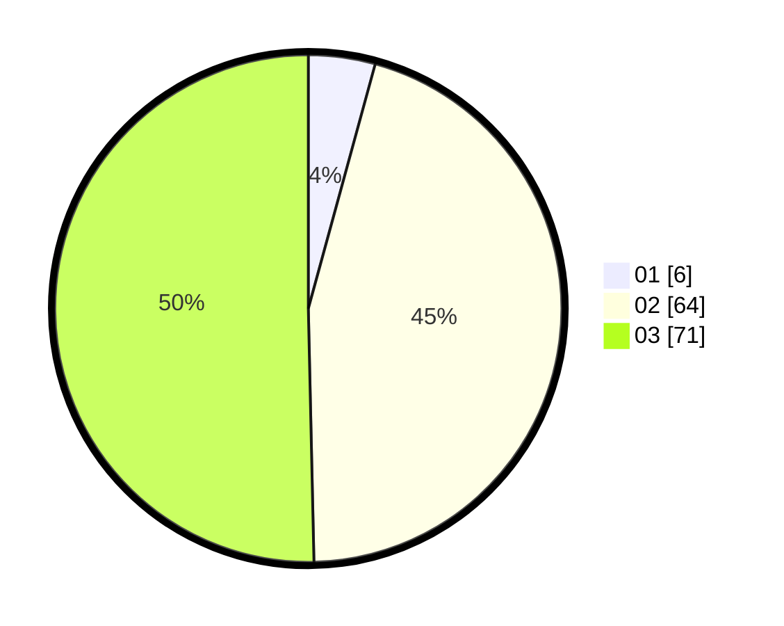

# Hasil

Hasil perolehan suara paslon dapat dilihat pada file paslon-01.txt, paslon-02.txt, dan paslon-03.txt.

Jika tidak ada, artinya data tersebut belum ada pada SIREKAP.

## Perolehan Suara

 * Paslon 01: **6**.
 * Paslon 02: **64**.
 * Paslon 03: **71**.

## Foto C Plano

https://sirekap-obj-formc.kpu.go.id/ee10/pemilu/ppwp/31/73/03/10/05/3173031005009-20240214-205335--69787d71-5753-4805-b70d-4c5fb8dd13f1.jpg

https://sirekap-obj-formc.kpu.go.id/ee10/pemilu/ppwp/31/73/03/10/05/3173031005009-20240214-203921--9c8d65ad-1c71-4188-b4c9-b0e6476d1c55.jpg

https://sirekap-obj-formc.kpu.go.id/ee10/pemilu/ppwp/31/73/03/10/05/3173031005009-20240214-205445--5eacba41-3d8d-4c44-97e8-782069072e32.jpg
