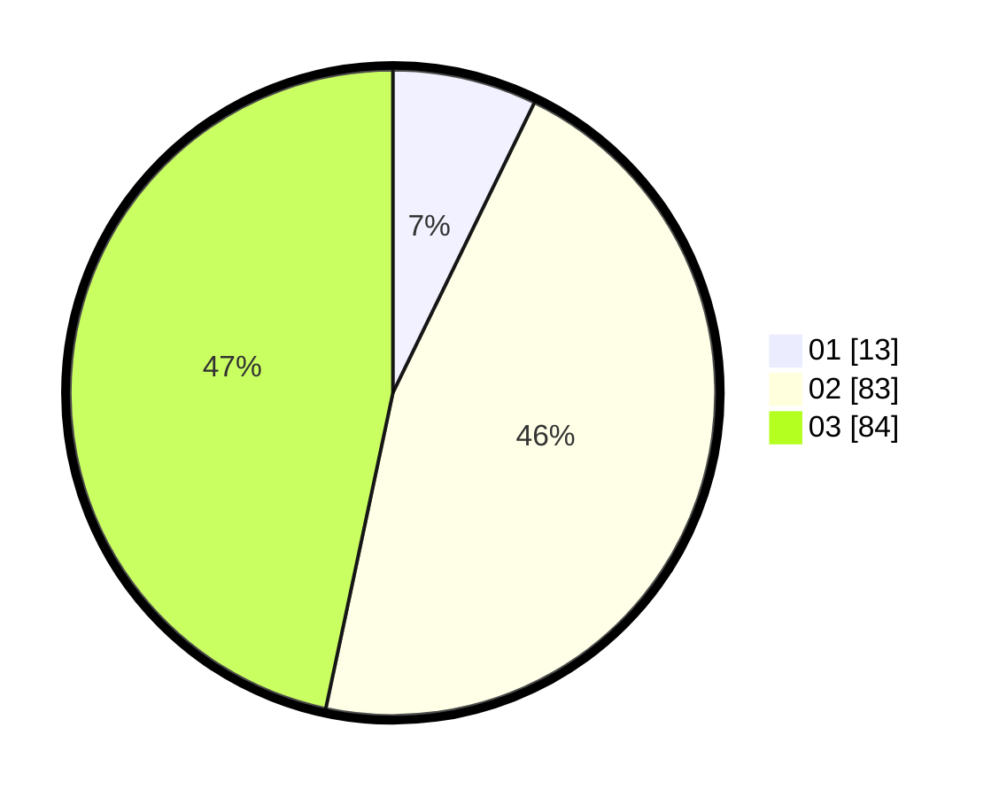

# Hasil

Hasil perolehan suara paslon dapat dilihat pada file paslon-01.txt, paslon-02.txt, dan paslon-03.txt.

Jika tidak ada, artinya data tersebut belum ada pada SIREKAP.

## Perolehan Suara

 * Paslon 01: **13**.
 * Paslon 02: **83**.
 * Paslon 03: **84**.

## Foto C Plano

https://sirekap-obj-formc.kpu.go.id/a3e2/pemilu/ppwp/31/73/03/10/05/3173031005011-20240215-221116--e65e5e2e-e6df-4888-b06b-bc9ac20a6202.jpg

https://sirekap-obj-formc.kpu.go.id/a3e2/pemilu/ppwp/31/73/03/10/05/3173031005011-20240215-221117--1c26079b-88af-43f0-b288-c4b9890950b4.jpg

https://sirekap-obj-formc.kpu.go.id/a3e2/pemilu/ppwp/31/73/03/10/05/3173031005011-20240215-221117--f164fa1f-eaf2-4d89-af21-200a181bce37.jpg

## DATA PEMILIH TETAP

Jumlah pemilih dalam DPT: **244**.
 * L: **112**.
 * P: **132**.

## DATA PENGGUNA HAK PILIH

Jumlah pengguna hak pilih dalam DPT: **177**.
 * L: **83**.
 * P: **94**.

Jumlah pengguna hak pilih dalam DPTb: **3**.
 * L: **3**.
 * P: **0**.

Jumlah pengguna hak pilih dalam DPK: **0**.
 * L: **0**.
 * P: **0**.

Jumlah pengguna hak pilih: **180**.
 * L: **86**.
 * P: **94**.

## JUMLAH SUARA SAH DAN TIDAK SAH

JUMLAH SELURUH SUARA SAH: **180**.

JUMLAH SUARA TIDAK SAH: **0**.

JUMLAH SELURUH SUARA SAH DAN SUARA TIDAK SAH: **180**.
