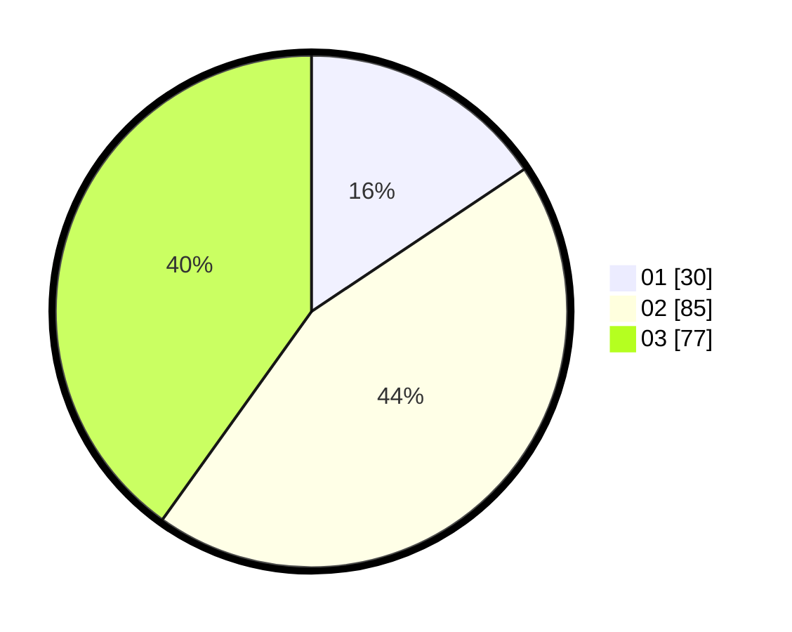

# Hasil

Hasil perolehan suara paslon dapat dilihat pada file paslon-01.txt, paslon-02.txt, dan paslon-03.txt.

Jika tidak ada, artinya data tersebut belum ada pada SIREKAP.

## Perolehan Suara

 * Paslon 01: **30**.
 * Paslon 02: **85**.
 * Paslon 03: **77**.

## Foto C Plano

https://sirekap-obj-formc.kpu.go.id/1cb4/pemilu/ppwp/31/73/03/10/05/3173031005012-20240214-185337--f984dd86-dba2-412a-97ce-276e9bea5f62.jpg

https://sirekap-obj-formc.kpu.go.id/1cb4/pemilu/ppwp/31/73/03/10/05/3173031005012-20240214-185444--2d85dc34-8842-4559-8940-4b330819b183.jpg

https://sirekap-obj-formc.kpu.go.id/1cb4/pemilu/ppwp/31/73/03/10/05/3173031005012-20240214-185541--da0f28a9-fd54-49f3-8419-03d73b993bdf.jpg

## DATA PEMILIH TETAP

Jumlah pemilih dalam DPT: **261**.
 * L: **132**.
 * P: **129**.

## DATA PENGGUNA HAK PILIH

Jumlah pengguna hak pilih dalam DPT: **196**.
 * L: **98**.
 * P: **98**.

Jumlah pengguna hak pilih dalam DPTb: **0**.
 * L: **0**.
 * P: **0**.

Jumlah pengguna hak pilih dalam DPK: **2**.
 * L: **1**.
 * P: **1**.

Jumlah pengguna hak pilih: **198**.
 * L: **99**.
 * P: **99**.

## JUMLAH SUARA SAH DAN TIDAK SAH

JUMLAH SELURUH SUARA SAH: **192**.

JUMLAH SUARA TIDAK SAH: **6**.

JUMLAH SELURUH SUARA SAH DAN SUARA TIDAK SAH: **198**.
