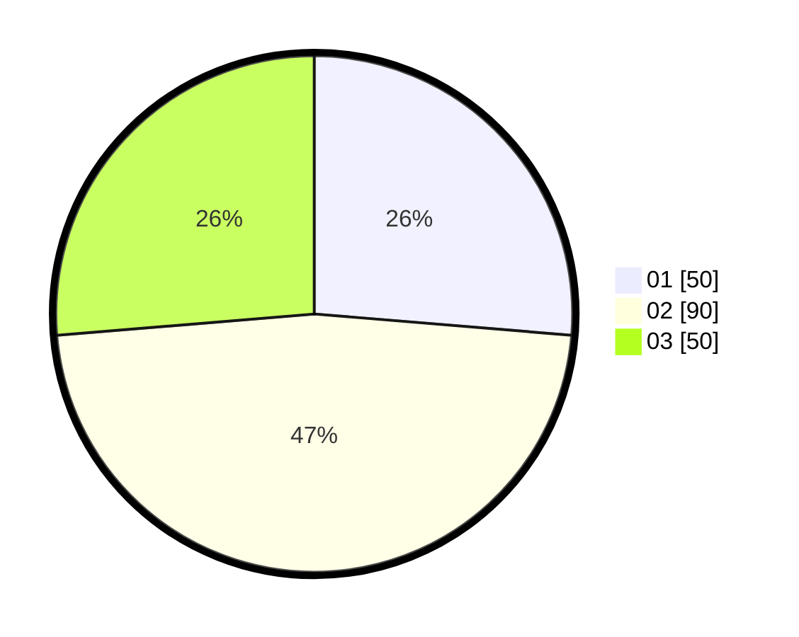

# Hasil

Hasil perolehan suara paslon dapat dilihat pada file paslon-01.txt, paslon-02.txt, dan paslon-03.txt.

Jika tidak ada, artinya data tersebut belum ada pada SIREKAP.

## Perolehan Suara

 * Paslon 01: **50**.
 * Paslon 02: **90**.
 * Paslon 03: **50**.

## Foto C Plano

https://sirekap-obj-formc.kpu.go.id/2ba0/pemilu/ppwp/31/73/03/10/05/3173031005013-20240214-210633--43fd773f-f589-439b-8355-0570f6d0cbd4.jpg

https://sirekap-obj-formc.kpu.go.id/2ba0/pemilu/ppwp/31/73/03/10/05/3173031005013-20240214-210852--6215b0ba-d86d-4a40-acd6-867ccf7aaefb.jpg

https://sirekap-obj-formc.kpu.go.id/2ba0/pemilu/ppwp/31/73/03/10/05/3173031005013-20240214-211027--f58162e0-bedf-4cf5-9542-080644cab65b.jpg
