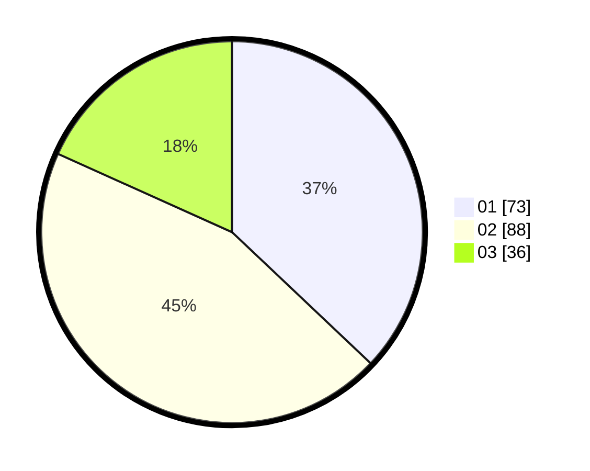

# Hasil

Hasil perolehan suara paslon dapat dilihat pada file paslon-01.txt, paslon-02.txt, dan paslon-03.txt.

Jika tidak ada, artinya data tersebut belum ada pada SIREKAP.

## Perolehan Suara

 * Paslon 01: **73**.
 * Paslon 02: **88**.
 * Paslon 03: **36**.

## Foto C Plano

https://sirekap-obj-formc.kpu.go.id/b2a2/pemilu/ppwp/31/73/03/10/05/3173031005018-20240214-211625--d440ae53-13a3-4928-bb48-e2852f51e236.jpg

https://sirekap-obj-formc.kpu.go.id/b2a2/pemilu/ppwp/31/73/03/10/05/3173031005018-20240214-211148--a461f8b8-3e1f-424b-9f8a-3fc30012d6a6.jpg

https://sirekap-obj-formc.kpu.go.id/b2a2/pemilu/ppwp/31/73/03/10/05/3173031005018-20240214-211000--22396ea0-dec3-496d-a3a4-c5a160140f92.jpg
