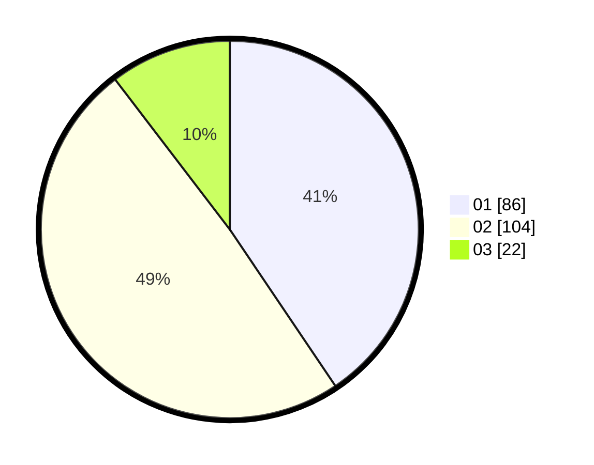

# Hasil

Hasil perolehan suara paslon dapat dilihat pada file paslon-01.txt, paslon-02.txt, dan paslon-03.txt.

Jika tidak ada, artinya data tersebut belum ada pada SIREKAP.

## Perolehan Suara

 * Paslon 01: **86**.
 * Paslon 02: **104**.
 * Paslon 03: **22**.

## Foto C Plano

https://sirekap-obj-formc.kpu.go.id/18d1/pemilu/ppwp/31/73/03/10/05/3173031005019-20240214-205247--4fdf9d83-7c3c-4bbc-9b14-60afe2094016.jpg

https://sirekap-obj-formc.kpu.go.id/18d1/pemilu/ppwp/31/73/03/10/05/3173031005019-20240214-222841--79c468f4-802c-47e8-8fed-ee62cd1518b4.jpg

https://sirekap-obj-formc.kpu.go.id/18d1/pemilu/ppwp/31/73/03/10/05/3173031005019-20240214-221046--e79ed68d-8c42-4166-856e-7ef37090d5c2.jpg

## DATA PEMILIH TETAP

Jumlah pemilih dalam DPT: **270**.
 * L: **145**.
 * P: **125**.

## DATA PENGGUNA HAK PILIH

Jumlah pengguna hak pilih dalam DPT: **220**.
 * L: **118**.
 * P: **102**.

Jumlah pengguna hak pilih dalam DPTb: **0**.
 * L: **0**.
 * P: **0**.

Jumlah pengguna hak pilih dalam DPK: **0**.
 * L: **0**.
 * P: **0**.

Jumlah pengguna hak pilih: **220**.
 * L: **118**.
 * P: **102**.

## JUMLAH SUARA SAH DAN TIDAK SAH

JUMLAH SELURUH SUARA SAH: **212**.

JUMLAH SUARA TIDAK SAH: **8**.

JUMLAH SELURUH SUARA SAH DAN SUARA TIDAK SAH: **220**.
