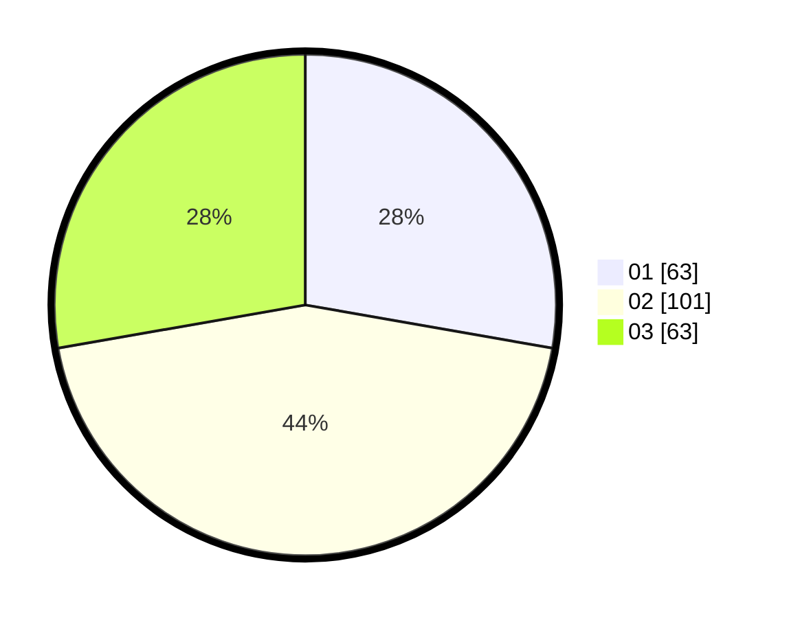

# Hasil

Hasil perolehan suara paslon dapat dilihat pada file paslon-01.txt, paslon-02.txt, dan paslon-03.txt.

Jika tidak ada, artinya data tersebut belum ada pada SIREKAP.

## Perolehan Suara

 * Paslon 01: **63**.
 * Paslon 02: **101**.
 * Paslon 03: **63**.

## Foto C Plano

https://sirekap-obj-formc.kpu.go.id/76e6/pemilu/ppwp/31/73/03/10/06/3173031006002-20240214-195057--2d8d41cf-afef-444a-8557-8763e6aad096.jpg

https://sirekap-obj-formc.kpu.go.id/76e6/pemilu/ppwp/31/73/03/10/06/3173031006002-20240214-195138--da0af56a-5747-42a4-87de-b15ccf757783.jpg

https://sirekap-obj-formc.kpu.go.id/76e6/pemilu/ppwp/31/73/03/10/06/3173031006002-20240214-195230--eeff5d76-3fe4-47be-92b2-9a01cc2fb5dd.jpg

## DATA PEMILIH TETAP

Jumlah pemilih dalam DPT: **293**.
 * L: **158**.
 * P: **135**.

## DATA PENGGUNA HAK PILIH

Jumlah pengguna hak pilih dalam DPT: **223**.
 * L: **119**.
 * P: **104**.

Jumlah pengguna hak pilih dalam DPTb: **4**.
 * L: **2**.
 * P: **2**.

Jumlah pengguna hak pilih dalam DPK: **3**.
 * L: **3**.
 * P: **0**.

Jumlah pengguna hak pilih: **230**.
 * L: **124**.
 * P: **106**.

## JUMLAH SUARA SAH DAN TIDAK SAH

JUMLAH SELURUH SUARA SAH: **227**.

JUMLAH SUARA TIDAK SAH: **3**.

JUMLAH SELURUH SUARA SAH DAN SUARA TIDAK SAH: **230**.
