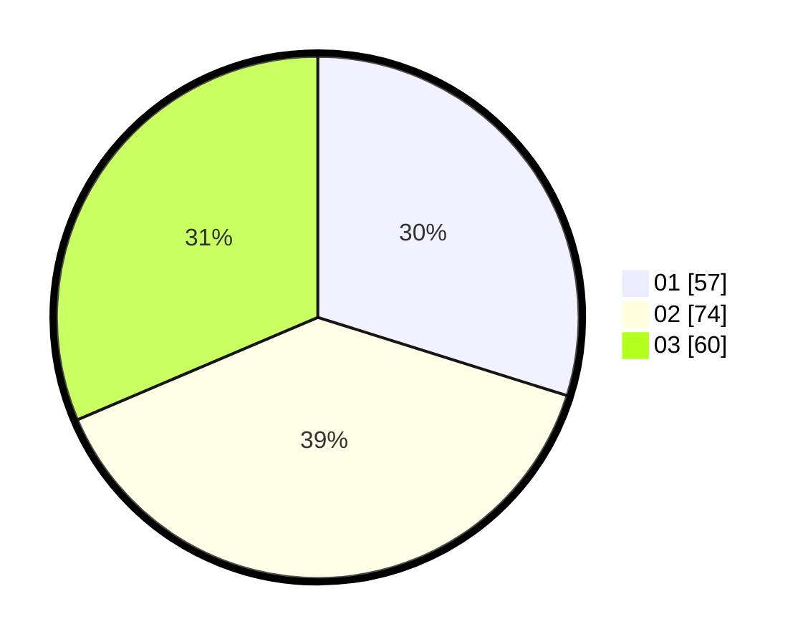

# Hasil

Hasil perolehan suara paslon dapat dilihat pada file paslon-01.txt, paslon-02.txt, dan paslon-03.txt.

Jika tidak ada, artinya data tersebut belum ada pada SIREKAP.

## Perolehan Suara

 * Paslon 01: **57**.
 * Paslon 02: **74**.
 * Paslon 03: **60**.

## Foto C Plano

https://sirekap-obj-formc.kpu.go.id/ef04/pemilu/ppwp/31/73/03/10/06/3173031006006-20240215-031924--b2fc31f5-fc2d-4f09-9259-bc0091d95662.jpg

https://sirekap-obj-formc.kpu.go.id/ef04/pemilu/ppwp/31/73/03/10/06/3173031006006-20240215-042441--2e547298-6ece-41d7-876d-3781f176c0c1.jpg

https://sirekap-obj-formc.kpu.go.id/ef04/pemilu/ppwp/31/73/03/10/06/3173031006006-20240215-042620--6cbd18ae-2cff-4e35-a323-c5df85b3566d.jpg
