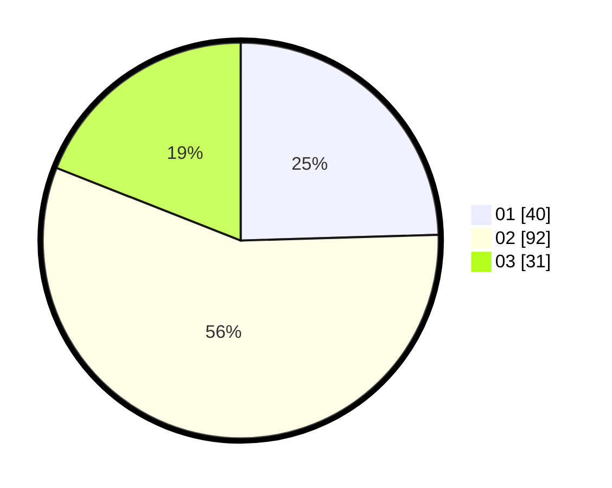

# Hasil

Hasil perolehan suara paslon dapat dilihat pada file paslon-01.txt, paslon-02.txt, dan paslon-03.txt.

Jika tidak ada, artinya data tersebut belum ada pada SIREKAP.

## Perolehan Suara

 * Paslon 01: **40**.
 * Paslon 02: **92**.
 * Paslon 03: **31**.

## Foto C Plano

https://sirekap-obj-formc.kpu.go.id/c225/pemilu/ppwp/31/73/03/10/06/3173031006010-20240214-205450--74d8f89b-1eed-4de8-95cb-17bfdc8e8dc0.jpg

https://sirekap-obj-formc.kpu.go.id/c225/pemilu/ppwp/31/73/03/10/06/3173031006010-20240214-205523--5b6d99a6-3a13-4c16-97b0-66948621f7d4.jpg

https://sirekap-obj-formc.kpu.go.id/c225/pemilu/ppwp/31/73/03/10/06/3173031006010-20240214-205549--8be2a7ca-0e60-45c6-8aa9-51a2cd6c609c.jpg
