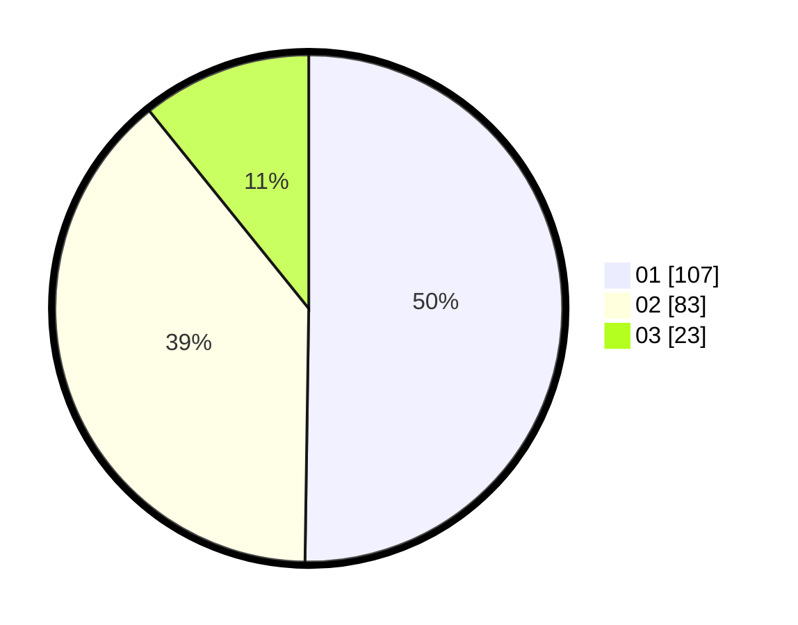

# Hasil

Hasil perolehan suara paslon dapat dilihat pada file paslon-01.txt, paslon-02.txt, dan paslon-03.txt.

Jika tidak ada, artinya data tersebut belum ada pada SIREKAP.

## Perolehan Suara

 * Paslon 01: **107**.
 * Paslon 02: **83**.
 * Paslon 03: **23**.

## Foto C Plano

https://sirekap-obj-formc.kpu.go.id/d208/pemilu/ppwp/31/73/03/10/06/3173031006012-20240214-235337--5144dc31-9714-4f35-a110-768501556c9d.jpg

https://sirekap-obj-formc.kpu.go.id/d208/pemilu/ppwp/31/73/03/10/06/3173031006012-20240214-191943--f899eff7-573f-4eae-8c84-c3a807b6e63d.jpg

https://sirekap-obj-formc.kpu.go.id/d208/pemilu/ppwp/31/73/03/10/06/3173031006012-20240214-192057--b75af4f4-7f94-456e-bb63-49d9bb5b98a2.jpg
