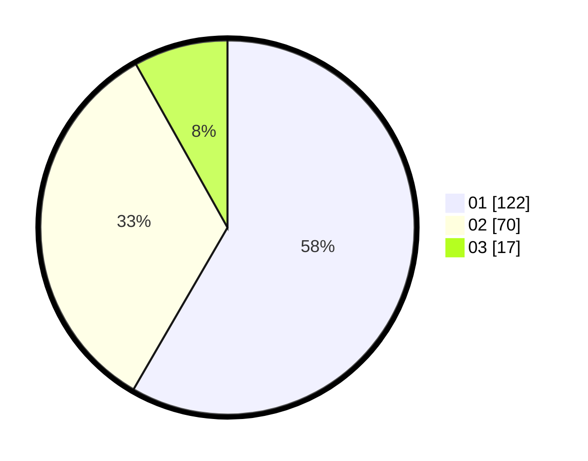

# Hasil

Hasil perolehan suara paslon dapat dilihat pada file paslon-01.txt, paslon-02.txt, dan paslon-03.txt.

Jika tidak ada, artinya data tersebut belum ada pada SIREKAP.

## Perolehan Suara

 * Paslon 01: **122**.
 * Paslon 02: **70**.
 * Paslon 03: **17**.

## Foto C Plano

https://sirekap-obj-formc.kpu.go.id/2bb7/pemilu/ppwp/31/73/03/10/06/3173031006013-20240214-195829--896a7bd9-b166-40ad-ae5f-d4d2fc940470.jpg

https://sirekap-obj-formc.kpu.go.id/2bb7/pemilu/ppwp/31/73/03/10/06/3173031006013-20240214-200435--16406eb9-cbe6-43b2-a97b-79a5589e4118.jpg

https://sirekap-obj-formc.kpu.go.id/2bb7/pemilu/ppwp/31/73/03/10/06/3173031006013-20240214-200639--59ccf5fa-5129-4d9b-8e6b-c227316339d5.jpg

## DATA PEMILIH TETAP

Jumlah pemilih dalam DPT: **275**.
 * L: **139**.
 * P: **136**.

## DATA PENGGUNA HAK PILIH

Jumlah pengguna hak pilih dalam DPT: **208**.
 * L: **104**.
 * P: **104**.

Jumlah pengguna hak pilih dalam DPTb: **1**.
 * L: **1**.
 * P: **0**.

Jumlah pengguna hak pilih dalam DPK: **4**.
 * L: **3**.
 * P: **1**.

Jumlah pengguna hak pilih: **213**.
 * L: **108**.
 * P: **105**.

## JUMLAH SUARA SAH DAN TIDAK SAH

JUMLAH SELURUH SUARA SAH: **209**.

JUMLAH SUARA TIDAK SAH: **4**.

JUMLAH SELURUH SUARA SAH DAN SUARA TIDAK SAH: **213**.
