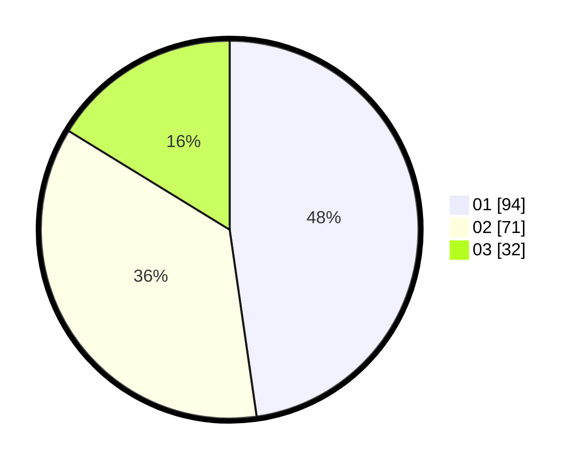

# Hasil

Hasil perolehan suara paslon dapat dilihat pada file paslon-01.txt, paslon-02.txt, dan paslon-03.txt.

Jika tidak ada, artinya data tersebut belum ada pada SIREKAP.

## Perolehan Suara

 * Paslon 01: **94**.
 * Paslon 02: **71**.
 * Paslon 03: **32**.

## Foto C Plano

https://sirekap-obj-formc.kpu.go.id/e51e/pemilu/ppwp/31/73/03/10/06/3173031006015-20240214-224257--be619075-62bb-4c2a-a8c6-d4bc015cc02e.jpg

https://sirekap-obj-formc.kpu.go.id/e51e/pemilu/ppwp/31/73/03/10/06/3173031006015-20240214-224536--141541f5-af2b-425e-88aa-511e518b1f4c.jpg

https://sirekap-obj-formc.kpu.go.id/e51e/pemilu/ppwp/31/73/03/10/06/3173031006015-20240214-224727--664fcd66-a5f4-46e7-81e2-c2f7ffa3b2dc.jpg

## DATA PEMILIH TETAP

Jumlah pemilih dalam DPT: **278**.
 * L: **130**.
 * P: **148**.

## DATA PENGGUNA HAK PILIH

Jumlah pengguna hak pilih dalam DPT: **203**.
 * L: **89**.
 * P: **114**.

Jumlah pengguna hak pilih dalam DPTb: **0**.
 * L: **0**.
 * P: **0**.

Jumlah pengguna hak pilih dalam DPK: **0**.
 * L: **0**.
 * P: **0**.

Jumlah pengguna hak pilih: **203**.
 * L: **89**.
 * P: **114**.

## JUMLAH SUARA SAH DAN TIDAK SAH

JUMLAH SELURUH SUARA SAH: **197**.

JUMLAH SUARA TIDAK SAH: **6**.

JUMLAH SELURUH SUARA SAH DAN SUARA TIDAK SAH: **203**.
