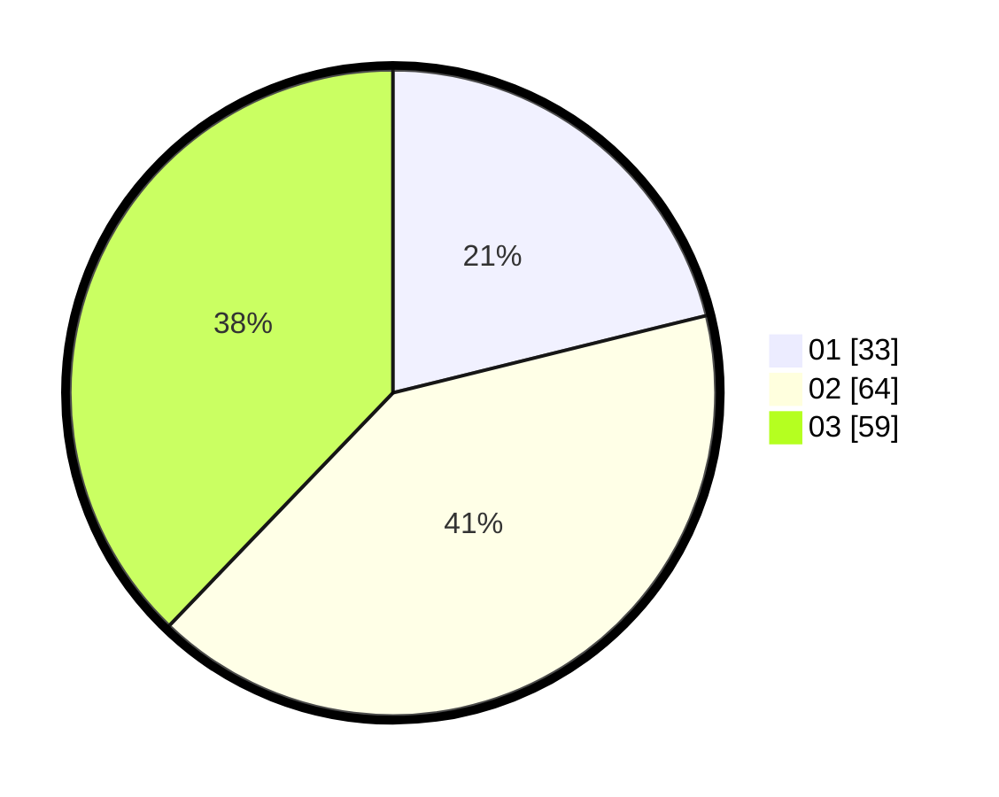

# Hasil

Hasil perolehan suara paslon dapat dilihat pada file paslon-01.txt, paslon-02.txt, dan paslon-03.txt.

Jika tidak ada, artinya data tersebut belum ada pada SIREKAP.

## Perolehan Suara

 * Paslon 01: **33**.
 * Paslon 02: **64**.
 * Paslon 03: **59**.

## Foto C Plano

https://sirekap-obj-formc.kpu.go.id/4c9f/pemilu/ppwp/31/73/03/10/06/3173031006023-20240214-231654--3b6d6a6c-0da1-4737-b7e9-85e9232c6296.jpg

https://sirekap-obj-formc.kpu.go.id/4c9f/pemilu/ppwp/31/73/03/10/06/3173031006023-20240214-232742--ef1bee08-455d-4ba7-b8c5-49478e567d33.jpg

https://sirekap-obj-formc.kpu.go.id/4c9f/pemilu/ppwp/31/73/03/10/06/3173031006023-20240214-233056--306370e6-32e4-48c8-9d72-4e76144a97db.jpg
