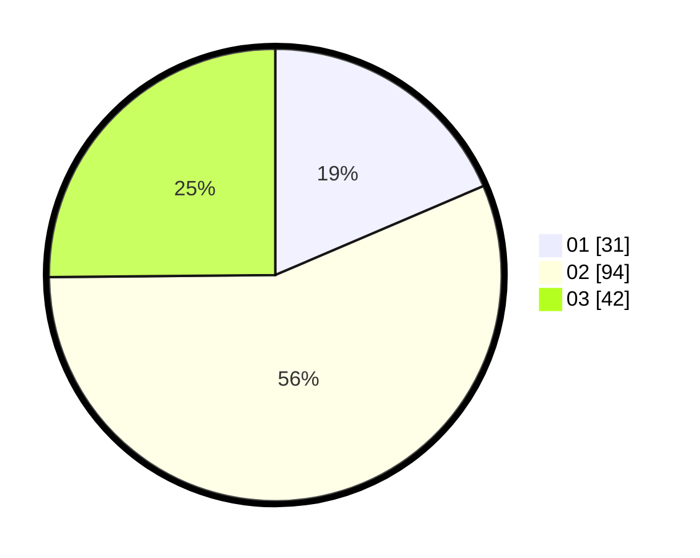

# Hasil

Hasil perolehan suara paslon dapat dilihat pada file paslon-01.txt, paslon-02.txt, dan paslon-03.txt.

Jika tidak ada, artinya data tersebut belum ada pada SIREKAP.

## Perolehan Suara

 * Paslon 01: **31**.
 * Paslon 02: **94**.
 * Paslon 03: **42**.

## Foto C Plano

https://sirekap-obj-formc.kpu.go.id/ffb6/pemilu/ppwp/31/73/03/10/06/3173031006033-20240214-192453--d8398b23-3abf-43d1-9b93-cba4c4fcc289.jpg

https://sirekap-obj-formc.kpu.go.id/ffb6/pemilu/ppwp/31/73/03/10/06/3173031006033-20240214-192643--f56baa6c-e39b-4f35-9c00-b7a34f3009f7.jpg

https://sirekap-obj-formc.kpu.go.id/ffb6/pemilu/ppwp/31/73/03/10/06/3173031006033-20240214-192805--2b43c767-a172-4da3-8c7e-121153cf74c2.jpg

## DATA PEMILIH TETAP

Jumlah pemilih dalam DPT: **263**.
 * L: **129**.
 * P: **134**.

## DATA PENGGUNA HAK PILIH

Jumlah pengguna hak pilih dalam DPT: **171**.
 * L: **83**.
 * P: **88**.

Jumlah pengguna hak pilih dalam DPTb: **0**.
 * L: **0**.
 * P: **0**.

Jumlah pengguna hak pilih dalam DPK: **0**.
 * L: **0**.
 * P: **0**.

Jumlah pengguna hak pilih: **171**.
 * L: **83**.
 * P: **88**.

## JUMLAH SUARA SAH DAN TIDAK SAH

JUMLAH SELURUH SUARA SAH: **167**.

JUMLAH SUARA TIDAK SAH: **4**.

JUMLAH SELURUH SUARA SAH DAN SUARA TIDAK SAH: **171**.
