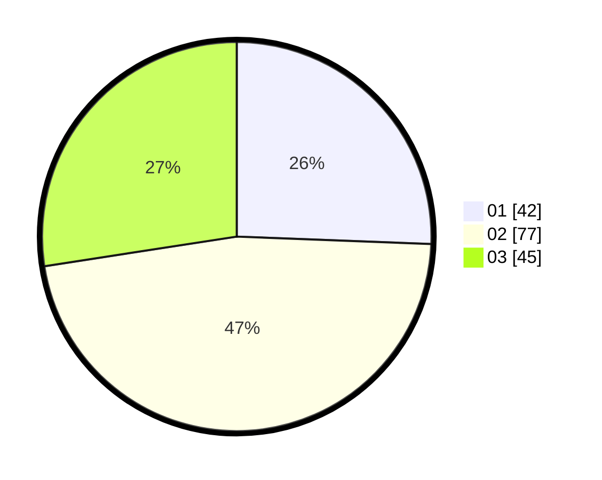

# Hasil

Hasil perolehan suara paslon dapat dilihat pada file paslon-01.txt, paslon-02.txt, dan paslon-03.txt.

Jika tidak ada, artinya data tersebut belum ada pada SIREKAP.

## Perolehan Suara

 * Paslon 01: **42**.
 * Paslon 02: **77**.
 * Paslon 03: **45**.

## Foto C Plano

https://sirekap-obj-formc.kpu.go.id/a45a/pemilu/ppwp/31/73/03/10/06/3173031006038-20240214-155254--abf0bb57-b951-4ffe-8926-4319ce01156e.jpg

https://sirekap-obj-formc.kpu.go.id/a45a/pemilu/ppwp/31/73/03/10/06/3173031006038-20240214-155619--e9bf4b27-3612-46b6-89c0-138dc9386cd3.jpg

https://sirekap-obj-formc.kpu.go.id/a45a/pemilu/ppwp/31/73/03/10/06/3173031006038-20240214-155655--73cfb68f-d12d-47ea-9467-2f4084c3a021.jpg

## DATA PEMILIH TETAP

Jumlah pemilih dalam DPT: **269**.
 * L: **141**.
 * P: **128**.

## DATA PENGGUNA HAK PILIH

Jumlah pengguna hak pilih dalam DPT: **166**.
 * L: **81**.
 * P: **85**.

Jumlah pengguna hak pilih dalam DPTb: **0**.
 * L: **0**.
 * P: **0**.

Jumlah pengguna hak pilih dalam DPK: **1**.
 * L: **1**.
 * P: **0**.

Jumlah pengguna hak pilih: **167**.
 * L: **82**.
 * P: **85**.

## JUMLAH SUARA SAH DAN TIDAK SAH

JUMLAH SELURUH SUARA SAH: **164**.

JUMLAH SUARA TIDAK SAH: **3**.

JUMLAH SELURUH SUARA SAH DAN SUARA TIDAK SAH: **167**.
