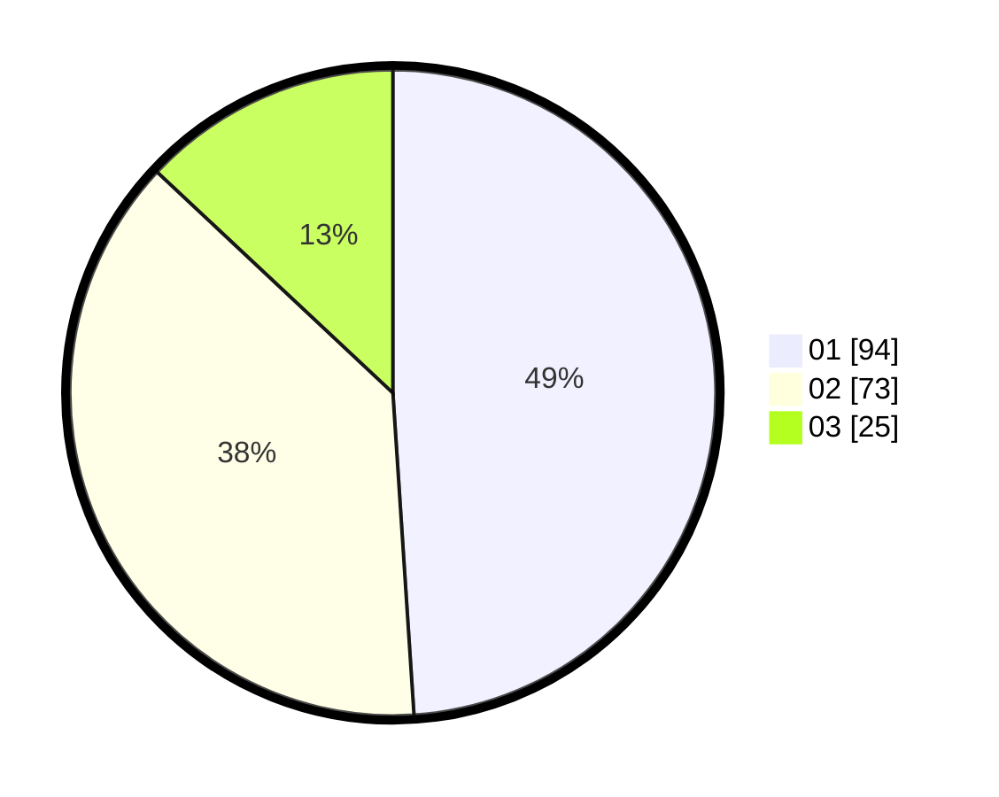

# Hasil

Hasil perolehan suara paslon dapat dilihat pada file paslon-01.txt, paslon-02.txt, dan paslon-03.txt.

Jika tidak ada, artinya data tersebut belum ada pada SIREKAP.

## Perolehan Suara

 * Paslon 01: **94**.
 * Paslon 02: **73**.
 * Paslon 03: **25**.

## Foto C Plano

https://sirekap-obj-formc.kpu.go.id/3fc5/pemilu/ppwp/31/73/03/10/06/3173031006039-20240214-201142--cc1ecea7-b0f8-4cec-a817-f55b90f656d1.jpg

https://sirekap-obj-formc.kpu.go.id/3fc5/pemilu/ppwp/31/73/03/10/06/3173031006039-20240214-200647--d9b7c769-24a8-4425-b5cd-1f0428a45b15.jpg

https://sirekap-obj-formc.kpu.go.id/3fc5/pemilu/ppwp/31/73/03/10/06/3173031006039-20240214-200945--ba8f5c81-a928-4357-80da-81e138cf8d6c.jpg
