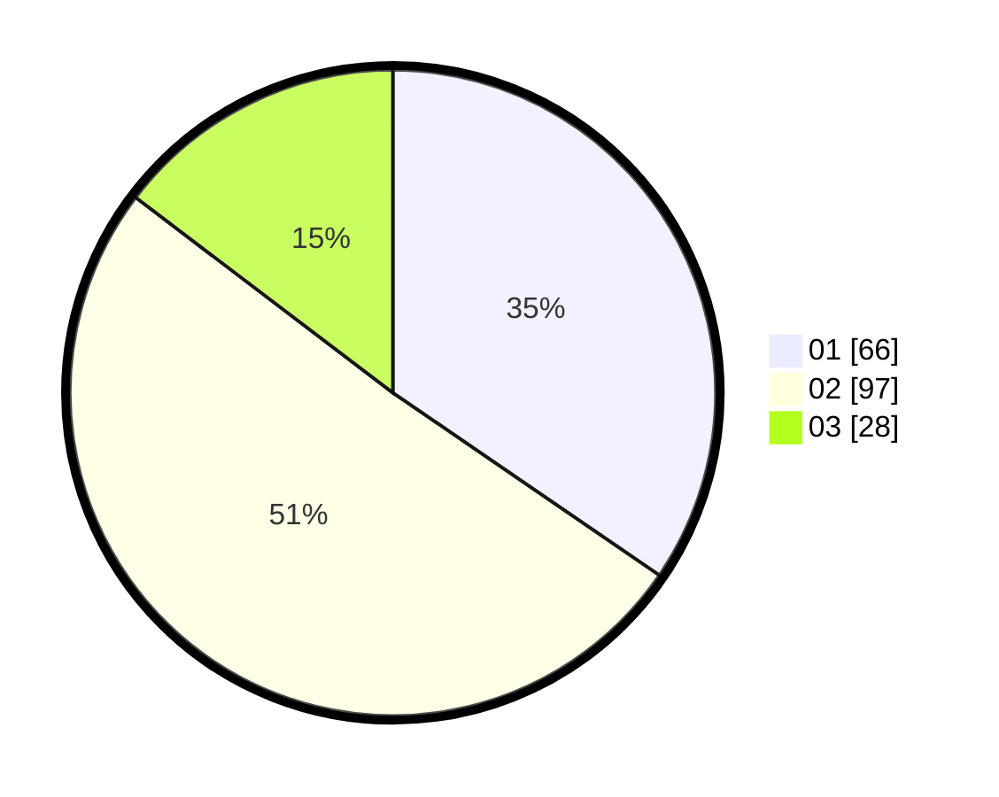

# Hasil

Hasil perolehan suara paslon dapat dilihat pada file paslon-01.txt, paslon-02.txt, dan paslon-03.txt.

Jika tidak ada, artinya data tersebut belum ada pada SIREKAP.

## Perolehan Suara

 * Paslon 01: **66**.
 * Paslon 02: **97**.
 * Paslon 03: **28**.

## Foto C Plano

https://sirekap-obj-formc.kpu.go.id/5128/pemilu/ppwp/31/73/03/10/06/3173031006040-20240214-203512--1cdedaca-f4b2-4722-b484-751b31be8fc1.jpg

https://sirekap-obj-formc.kpu.go.id/5128/pemilu/ppwp/31/73/03/10/06/3173031006040-20240214-203756--f841829f-513d-4fbf-b204-9bed3c414a66.jpg

https://sirekap-obj-formc.kpu.go.id/5128/pemilu/ppwp/31/73/03/10/06/3173031006040-20240214-204007--bbc6c15b-d1d5-4cdb-9645-9ee1c30e22cf.jpg

## DATA PEMILIH TETAP

Jumlah pemilih dalam DPT: **266**.
 * L: **134**.
 * P: **132**.

## DATA PENGGUNA HAK PILIH

Jumlah pengguna hak pilih dalam DPT: **194**.
 * L: **94**.
 * P: **100**.

Jumlah pengguna hak pilih dalam DPTb: **0**.
 * L: **0**.
 * P: **0**.

Jumlah pengguna hak pilih dalam DPK: **1**.
 * L: **0**.
 * P: **1**.

Jumlah pengguna hak pilih: **195**.
 * L: **94**.
 * P: **101**.

## JUMLAH SUARA SAH DAN TIDAK SAH

JUMLAH SELURUH SUARA SAH: **191**.

JUMLAH SUARA TIDAK SAH: **4**.

JUMLAH SELURUH SUARA SAH DAN SUARA TIDAK SAH: **195**.
