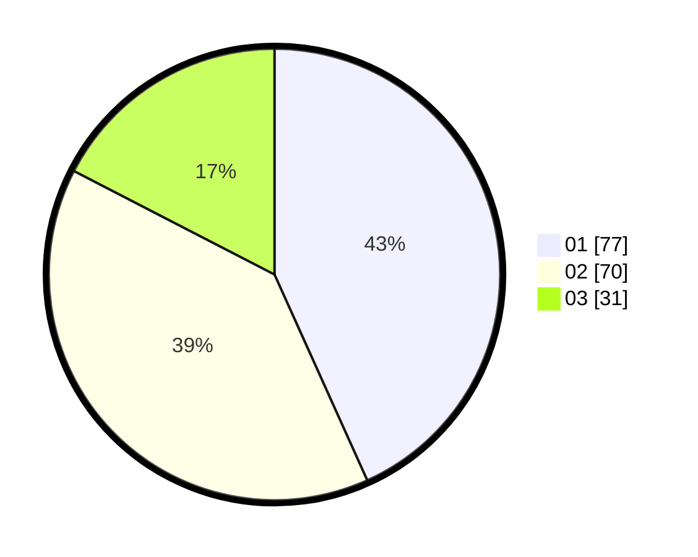

# Hasil

Hasil perolehan suara paslon dapat dilihat pada file paslon-01.txt, paslon-02.txt, dan paslon-03.txt.

Jika tidak ada, artinya data tersebut belum ada pada SIREKAP.

## Perolehan Suara

 * Paslon 01: **77**.
 * Paslon 02: **70**.
 * Paslon 03: **31**.

## Foto C Plano

https://sirekap-obj-formc.kpu.go.id/60e5/pemilu/ppwp/31/73/03/10/06/3173031006047-20240214-194617--dca64f8c-cd20-4fd6-b231-fac750a278c6.jpg

https://sirekap-obj-formc.kpu.go.id/60e5/pemilu/ppwp/31/73/03/10/06/3173031006047-20240214-201059--1ccdd26f-5d15-4481-8bba-15449002ed10.jpg

https://sirekap-obj-formc.kpu.go.id/60e5/pemilu/ppwp/31/73/03/10/06/3173031006047-20240214-195022--16925981-eb04-44c1-9753-68db3f2aa411.jpg

## DATA PEMILIH TETAP

Jumlah pemilih dalam DPT: **245**.
 * L: **133**.
 * P: **112**.

## DATA PENGGUNA HAK PILIH

Jumlah pengguna hak pilih dalam DPT: **175**.
 * L: **95**.
 * P: **80**.

Jumlah pengguna hak pilih dalam DPTb: **0**.
 * L: **0**.
 * P: **0**.

Jumlah pengguna hak pilih dalam DPK: **5**.
 * L: **2**.
 * P: **3**.

Jumlah pengguna hak pilih: **180**.
 * L: **97**.
 * P: **83**.

## JUMLAH SUARA SAH DAN TIDAK SAH

JUMLAH SELURUH SUARA SAH: **178**.

JUMLAH SUARA TIDAK SAH: **2**.

JUMLAH SELURUH SUARA SAH DAN SUARA TIDAK SAH: **180**.
