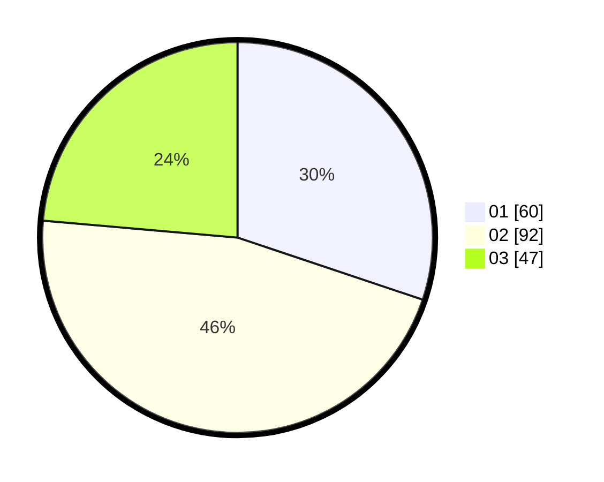

# Hasil

Hasil perolehan suara paslon dapat dilihat pada file paslon-01.txt, paslon-02.txt, dan paslon-03.txt.

Jika tidak ada, artinya data tersebut belum ada pada SIREKAP.

## Perolehan Suara

 * Paslon 01: **60**.
 * Paslon 02: **92**.
 * Paslon 03: **47**.

## Foto C Plano

https://sirekap-obj-formc.kpu.go.id/4d5b/pemilu/ppwp/31/73/03/10/06/3173031006051-20240214-225502--1ca1bb07-e20d-4750-8935-0d71e3e3f5a0.jpg

https://sirekap-obj-formc.kpu.go.id/4d5b/pemilu/ppwp/31/73/03/10/06/3173031006051-20240214-225556--0d448614-54cd-48ba-b371-0b4ab84c5ce0.jpg

https://sirekap-obj-formc.kpu.go.id/4d5b/pemilu/ppwp/31/73/03/10/06/3173031006051-20240214-225634--bf76bd62-89f3-4b2c-914b-fbec9965f236.jpg
